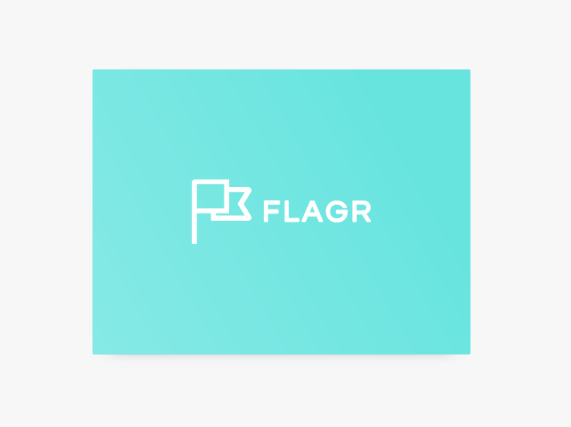

<p align="center">
    
</p>

<p align="center">
    <a href="https://goreportcard.com/report/github.com/checkr/flagr" target="_blank">
        
    </a>
    <a href="https://circleci.com/gh/checkr/flagr" target="_blank">
        
    </a>
</p>

## Introduction

Flagr is an open source Go service that delivers the right experience to the right entity and monitors the impact. It provides feature flags, experimentation (A/B testing), and dynamic configuration. It has clear swagger REST APIs for flags management and flag evaluation.

## Documentation
- [Flagr Documentation - https://checkr.github.io/flagr](https://checkr.github.io/flagr/)

## Quick demo

Try it with Docker.

```sh
# Get the checkr/flagr docker image
docker run -it -p 18000:18000 checkr/flagr

# Open the flagr homepage
open localhost:18000
```

Or try it on [https://try-flagr.herokuapp.com](https://try-flagr.herokuapp.com)

```
curl --request POST \
  --url https://try-flagr.herokuapp.com/api/v1/evaluation \
  --header 'content-type: application/json' \
  --data '{
	"entityID": "127",
	"entityType": "user",
	"entityContext": {
		"state": "NY"
	},
	"flagID": 1,
	"enableDebug": true
}'
```


## Flagr Evaluation Performance

Tested with `vegeta`. For more details, see [benchmarks](./benchmark).

```
Requests      [total, rate]            56521, 2000.04
Duration      [total, attack, wait]    28.2603654s, 28.259999871s, 365.529µs
Latencies     [mean, 50, 95, 99, max]  371.632µs, 327.991µs, 614.918µs, 1.385568ms, 12.50012ms
Bytes In      [total, mean]            23250552, 411.36
Bytes Out     [total, mean]            8308587, 147.00
Success       [ratio]                  100.00%
Status Codes  [code:count]             200:56521
Error Set:
```

## Flagr UI

<p align="center">
    
</p>

