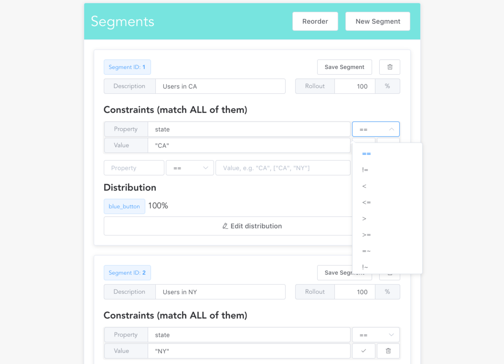

<p align="center">
    <a href="https://github.com/openflagr/flagr/actions/workflows/ci.yml?query=branch%3Amain+" target="_blank">
        
    </a>
    <a href="https://goreportcard.com/report/github.com/openflagr/flagr" target="_blank">
        
    </a>
    <a href="https://godoc.org/github.com/openflagr/flagr" target="_blank">
        
    </a>
    <a href="https://github.com/openflagr/flagr/releases" target="_blank">
        
    </a>
    <a href="https://codecov.io/gh/openflagr/flagr">
        
    </a>
    <a href="https://deepwiki.com/openflagr/flagr">
        
    </a>
</p>

## Introduction

`openflagr/flagr` is a community-driven OSS effort of advancing the development of Flagr.

Flagr is an open source Go service that delivers the right experience to the right entity and monitors the impact. It provides feature flags, experimentation (A/B testing), and dynamic configuration. It has clear swagger REST APIs for flags management and flag evaluation.

## Documentation

- https://openflagr.github.io/flagr

## Quick demo

Try it with Docker.

```sh
# Start the docker container
docker pull ghcr.io/openflagr/flagr
docker run -it -p 18000:18000 ghcr.io/openflagr/flagr

# Open the Flagr UI
open localhost:18000
```

Or try it on [https://try-flagr.onrender.com](https://try-flagr.onrender.com),
it may take a while for a cold start, and every commit to the `main` branch will trigger
a redeployment of the demo website.

```
curl --request POST \
     --url https://try-flagr.onrender.com/api/v1/evaluation \
     --header 'content-type: application/json' \
     --data '{
       "entityID": "127",
       "entityType": "user",
       "entityContext": {
         "state": "NY"
       },
       "flagID": 1,
       "enableDebug": true
     }'
```

## Flagr Evaluation Performance

Tested with `vegeta`. For more details, see [benchmarks](./benchmark).

```
Requests      [total, rate]            56521, 2000.04
Duration      [total, attack, wait]    28.2603654s, 28.259999871s, 365.529µs
Latencies     [mean, 50, 95, 99, max]  371.632µs, 327.991µs, 614.918µs, 1.385568ms, 12.50012ms
Bytes In      [total, mean]            23250552, 411.36
Bytes Out     [total, mean]            8308587, 147.00
Success       [ratio]                  100.00%
Status Codes  [code:count]             200:56521
Error Set:
```

## Flagr UI

<p align="center">
    
</p>

## Client Libraries

| Language   | Clients                                         |
| ---------- | ----------------------------------------------- |
| Go         | [goflagr](https://github.com/openflagr/goflagr) |
| Javascript | [jsflagr](https://github.com/openflagr/jsflagr) |
| Python     | [pyflagr](https://github.com/openflagr/pyflagr) |
| Ruby       | [rbflagr](https://github.com/openflagr/rbflagr) |

## License and Credit

- [`openflagr/flagr`](https://github.com/openflagr/flagr) Apache 2.0
- [`checkr/flagr`](https://github.com/checkr/flagr) Apache 2.0
