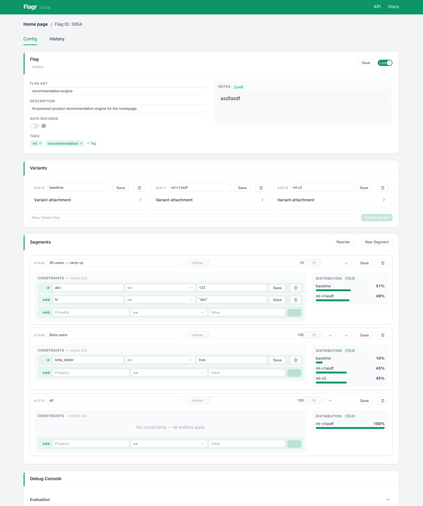

<p align="center">
    <a href="https://github.com/openflagr/flagr/actions/workflows/ci.yml?query=branch%3Amain+" target="_blank">
        
    </a>
    <a href="https://goreportcard.com/report/github.com/openflagr/flagr" target="_blank">
        
    </a>
    <a href="https://godoc.org/github.com/openflagr/flagr" target="_blank">
        
    </a>
    <a href="https://github.com/openflagr/flagr/releases" target="_blank">
        
    </a>
    <a href="https://codecov.io/gh/openflagr/flagr">
        
    </a>
    <a href="https://deepwiki.com/openflagr/flagr">
        
    </a>
</p>

## What is Flagr?

Flagr is an open-source **Go** service for feature flags, A/B tests, and dynamic configuration. One primitive, the **flag**, backs all three: your code calls **`POST /api/v1/evaluation`**, Flagr looks at **who** is asking (`entityID`, `entityContext`), and returns a **variant** plus optional JSON **attachment**.

That lets you **decouple deploy from release** (ship code dark, turn it on per audience), run **experiments** with sticky assignment, and change **runtime config** without redeploying.

[`openflagr/flagr`](https://github.com/openflagr/flagr) is the community home of Flagr, continuing development from the original [`checkr/flagr`](https://github.com/checkr/flagr).

---

## Documentation

**Site:** [https://openflagr.github.io/flagr](https://openflagr.github.io/flagr) (VitePress)

**Contributors:** clone the repo and run **`make help`** (build, test, UI, CI targets). Docs: `make serve-docs` (http://127.0.0.1:8081/flagr/) / `make build-docs` → `docs/.vitepress/dist`.

| Page | Content |
|------|---------|
| [Behavioral contracts](https://openflagr.github.io/flagr/flagr_behavioral_contracts) | Eval vs exposure, recording, eval-only, cache |
| [Integration guide](https://openflagr.github.io/flagr/integration) | Eval, batch, exposures (client API) |
| [Contributing](https://openflagr.github.io/flagr/CONTRIBUTING) | Clone, build, test, OpenAPI |
| [Overview](https://openflagr.github.io/flagr/flagr_overview) | Concepts, running example, architecture |
| [Use cases](https://openflagr.github.io/flagr/flagr_use_cases) | Flags, A/B, dynamic config; [GET `?json=` eval](https://openflagr.github.io/flagr/flagr_use_cases#get-evaluation-browser-friendly) |
| [Built-in context injection](https://openflagr.github.io/flagr/flagr_injected_context) | `@ts*`, `@http_*` in `entityContext` |
| [Self-hosting](https://openflagr.github.io/flagr/flagr_self_host) | Docker, DB, Compose, K8s |
| [Environment variables](https://openflagr.github.io/flagr/flagr_env) | DB, auth, recorders (`pkg/config/env.go`) |
| [Exposure logging](https://openflagr.github.io/flagr/flagr_exposure) | Client impressions for A/B |
| [Data recorders](https://openflagr.github.io/flagr/flagr_eval_exposure_pipeline) | Kafka, Kinesis, Pub/Sub |
| [API reference](https://openflagr.github.io/flagr/api_docs) | OpenAPI |

---

## Features

- **Feature flags** - kill switches, targeted rollouts
- **GET evaluation** - `GET /api/v1/evaluation?json=…` (same JSON as POST; [use cases](https://openflagr.github.io/flagr/flagr_use_cases#get-evaluation-browser-friendly))
- **Built-in context injection** - `@ts*` and `@http_*` keys merged server-side ([guide](https://openflagr.github.io/flagr/flagr_injected_context))
- **Duplicate flag** - `POST /flags/{id}/duplicate` or UI **Duplicate Flag**
- **A/B testing** - deterministic assignment; pair with exposure logging
- **Dynamic configuration** - `variantAttachment` JSON on eval responses
- **GitOps** - `json_file` / `json_http`; `flagr-validate` in CI
- **Exposure logging** - `POST /exposures` for trustworthy denominators
- **Self-hosted** - official Docker image + env vars
- **Databases** - SQLite, MySQL, PostgreSQL, or JSON sources
- **Vue 3 UI** - TypeScript (`browser/flagr-ui`); `make build-ui`, `make test-e2e`

## Quick start

```sh
docker pull ghcr.io/openflagr/flagr
docker run -it -p 18000:18000 ghcr.io/openflagr/flagr

open http://localhost:18000
```

Demo API: [try-flagr.onrender.com](https://try-flagr.onrender.com) (may cold-start)

```sh
curl -sS -X POST https://try-flagr.onrender.com/api/v1/evaluation \
  -H 'content-type: application/json' \
  -d '{
    "entityID": "127",
    "entityType": "user",
    "entityContext": { "state": "NY" },
    "flagID": 1,
    "enableDebug": true
  }'
```

## Flagr UI

<p align="center">
    
</p>

## Architecture

Three parts ([overview diagram](https://openflagr.github.io/flagr/flagr_overview#architecture), [behavioral contracts](https://openflagr.github.io/flagr/flagr_behavioral_contracts)):

- **Evaluator** - `POST` or `GET /evaluation` reads **EvalCache** in memory (default reload **3s**; no per-request SQL). Bucketing and stickiness: [overview](https://openflagr.github.io/flagr/flagr_overview#rollout-and-deterministic-bucketing). GET: [use cases](https://openflagr.github.io/flagr/flagr_use_cases#get-evaluation-browser-friendly).
- **Manager** - CRUD + `flag_snapshot` rows; webhooks after commit.
- **Metrics** - async recorders (Kafka, Kinesis, Pub/Sub, Datar); slow sinks do not block eval.

Source: `pkg/handler/eval.go`, `eval_cache.go`, `crud.go`.

## Performance

[`vegeta`](./benchmark) load test (~2k req/s, sub-ms median in published run):

```
Requests      [total, rate]            56521, 2000.04
Duration      [total, attack, wait]    28.26s, 28.26s, 365.53µs
Latencies     [mean, 50, 95, 99, max]  371.63µs, 327.99µs, 614.92µs, 1.39ms, 12.50ms
Success       [ratio]                  100.00%
Status Codes  [code:count]             200:56521
```

## Client libraries

| Language | Client |
| -------- | ------ |
| Go | [goflagr](https://github.com/openflagr/goflagr) |
| JavaScript | [jsflagr](https://github.com/openflagr/jsflagr) |
| Python | [pyflagr](https://github.com/openflagr/pyflagr) |
| Ruby | [rbflagr](https://github.com/openflagr/rbflagr) |

## License

- [`openflagr/flagr`](https://github.com/openflagr/flagr) - Apache 2.0
- [`checkr/flagr`](https://github.com/checkr/flagr) - Apache 2.0 (original)