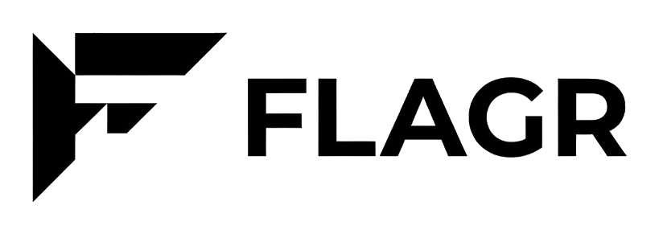
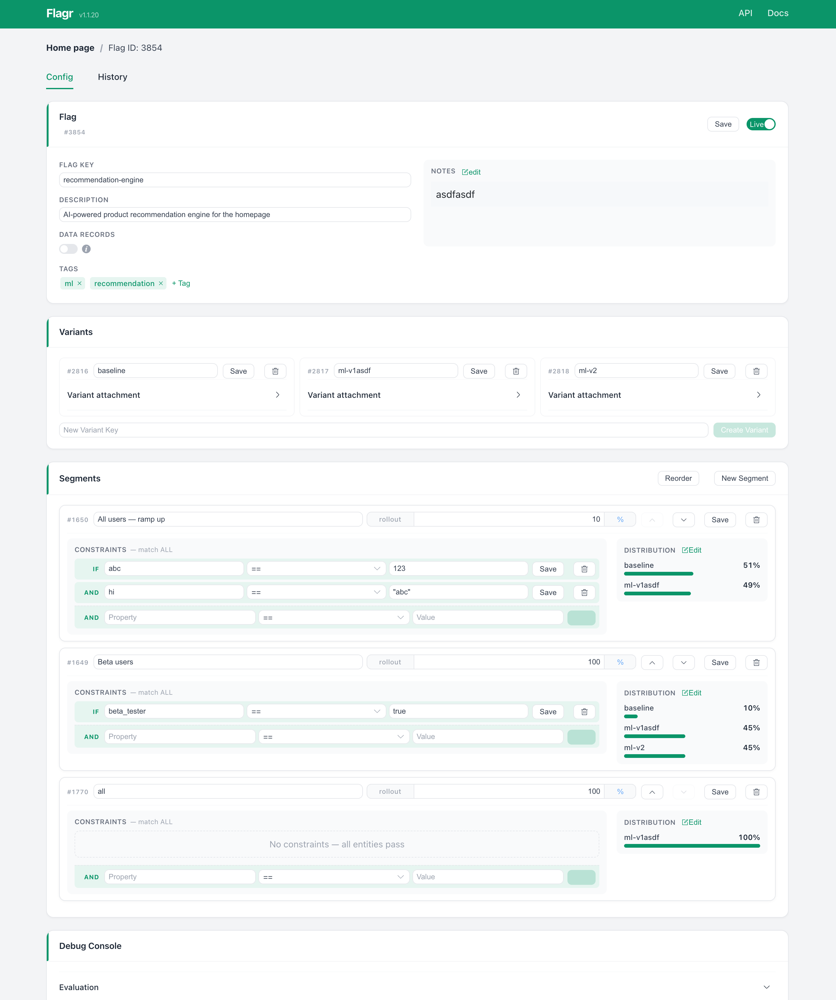

<p align="center">
    
</p>

<p align="center">
    <a href="https://github.com/openflagr/flagr/actions/workflows/ci.yml?query=branch%3Amain+" target="_blank">
        
    </a>
    <a href="https://goreportcard.com/report/github.com/openflagr/flagr" target="_blank">
        
    </a>
    <a href="https://godoc.org/github.com/openflagr/flagr" target="_blank">
        
    </a>
    <a href="https://github.com/openflagr/flagr/releases" target="_blank">
        
    </a>
    <a href="https://codecov.io/gh/openflagr/flagr">
        
    </a>
    <a href="https://deepwiki.com/openflagr/flagr">
        
    </a>
</p>

## What is Flagr?

Flagr is an open-source **Go** service for feature flags, A/B tests, and dynamic configuration. Your app calls **`POST /api/v1/evaluation`** with who is asking (`entityID`, `entityContext`); Flagr returns a **variant** and optional JSON **attachment**.

That lets you ship code dark and turn it on per audience, run experiments with sticky assignment, and change runtime config without redeploying. Self-hosted (SQLite, MySQL, PostgreSQL, or JSON/GitOps) with a Vue 3 UI and an official Docker image.

[`openflagr/flagr`](https://github.com/openflagr/flagr) continues development from the original [`checkr/flagr`](https://github.com/checkr/flagr).

## Quick start

```sh
docker pull ghcr.io/openflagr/flagr
docker run -it -p 18000:18000 ghcr.io/openflagr/flagr

open http://localhost:18000
```

Hosted demo: [try-flagr.onrender.com](https://try-flagr.onrender.com) (may cold-start)

```sh
curl -sS -X POST https://try-flagr.onrender.com/api/v1/evaluation \
  -H 'content-type: application/json' \
  -d '{
    "entityID": "127",
    "entityType": "user",
    "entityContext": { "state": "NY" },
    "flagID": 1,
    "enableDebug": true
  }'
```

<p align="center">
    
</p>

## Docs

**[Documentation](https://openflagr.github.io/flagr)** covers integration, self-hosting, environment variables, and the [API reference](https://openflagr.github.io/flagr/api_docs). Load test numbers: [`benchmark/`](./benchmark).

## Clients

| Language | Client |
| -------- | ------ |
| Go | [goflagr](https://github.com/openflagr/goflagr) |
| JavaScript | [jsflagr](https://github.com/openflagr/jsflagr) |
| Python | [pyflagr](https://github.com/openflagr/pyflagr) |
| Ruby | [rbflagr](https://github.com/openflagr/rbflagr) |

## Contribute

Issues and pull requests: [Contributing](https://openflagr.github.io/flagr/CONTRIBUTING). Local commands and code layout: [AGENTS.md](./AGENTS.md) (`make help`).

## License

Apache 2.0 ([`openflagr/flagr`](https://github.com/openflagr/flagr), original [`checkr/flagr`](https://github.com/checkr/flagr)).
