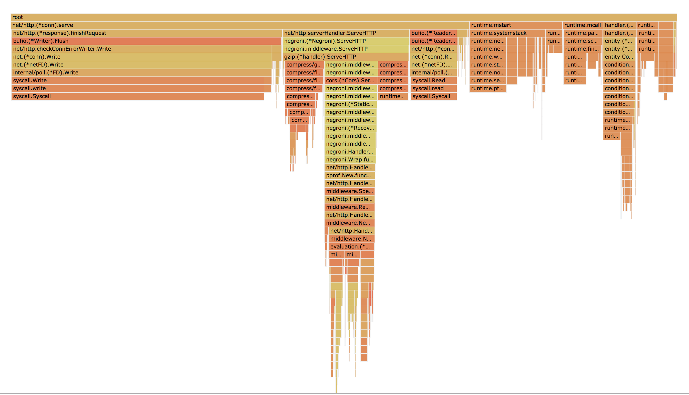

## Benchmark with vegeta

```
go get -u github.com/tsenart/vegeta
vegeta attack -targets ./postEvaluation.target -body ./postEvaluation.json -output ./postEvaluation.output -workers 100 -rate 2000
```

```
Requests      [total, rate]            56521, 2000.04
Duration      [total, attack, wait]    28.2603654s, 28.259999871s, 365.529µs
Latencies     [mean, 50, 95, 99, max]  371.632µs, 327.991µs, 614.918µs, 1.385568ms, 12.50012ms
Bytes In      [total, mean]            23250552, 411.36
Bytes Out     [total, mean]            8308587, 147.00
Success       [ratio]                  100.00%
Status Codes  [code:count]             200:56521
Error Set:
```

## Getting the flamegraph from go tool

```
curl http://localhost:18000/debug/pprof/profile -o /tmp/flagr_profile
go tool pprof -http=":8081" /tmp/flagr_profile
```


