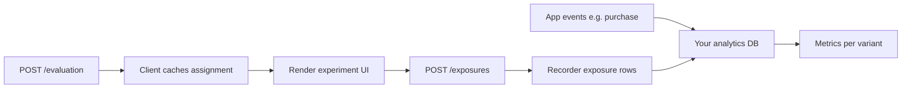

# Data Recorders & A/B Analysis

An evaluation engine that doesn't record its decisions is a black box: you
know *what* it assigned, but never *whether it mattered*. Flagr's job ends at
producing a variant and an event; the experiment verdict — conversion,
significance, lift — is computed downstream, in your warehouse, your stream
processor, your BI tool. This guide is about the bridge between those two
worlds: how Flagr emits events, what shape they take, and how to turn them
into a trustworthy A/B denominator.

Flagr is an **evaluation engine**: it assigns variants and can **emit events**
to your data pipeline. It does **not** run experiment analytics (conversion
rates, significance tests, warehouse modeling). That separation is
deliberate — analytics stacks change slowly and live in your data platform,
not in your flag service. Flagr's recorder layer is the contract between them.

This guide covers:

1. **Data recorders** — how eval and exposure rows reach Kafka, Kinesis,
   Pub/Sub, or Datar.
2. **Wire format** — the same `evalResult` JSON for every streaming recorder.
3. **Downstream handling** — including a minimal Kafka consumer as one example.
4. **A/B analysis** — why you need exposures, not just evaluations.

For the exposure API, see [Exposure Logging](flagr_exposure.md). For in-process
eval counts only (no exposures), see [Datar](flagr_datar.md). Recorder env vars:
[Environment Variables](flagr_env.md#data-record-destinations).

---

## Two event types on one wire shape

The central design decision in Flagr's recording layer is that evaluation
and exposure share *one* wire format. They are different events with different
meanings, but a downstream consumer parses them identically and branches on a
single field. This keeps your consumer code simple and your pipeline
schema-stable — you don't maintain two parsers for two topics.

| `recordSource` | Produced by | Meaning |
|----------------|-------------|---------|
| `evaluation` | `POST /evaluation` (and batch) | Server **assignment** for this request: which variant (if any) the evaluator returned for the entity. Includes the no-segment-match blank (no variant assigned). Flag-not-found and flag-disabled paths early-return **before** recording, so they do not appear in the stream. |
| `exposure` | `POST /exposures` | Client-reported **impression**: the user **saw** the experiment surface for that flag/variant (or flag only if variant omitted). |

**Do not** treat `evaluation` as "user saw the treatment" or `exposure` as
"user was assigned." For conversion analysis you almost always need
**exposures** (or your own impression signal) as the experiment **denominator**.

---

## Data recorders (where events go)

Flagr doesn't pick a streaming backend for you. Instead it fans each event
out to every recorder you list — so you can stream to Kafka for the data
team *and* keep lightweight counts in Datar for the dashboard, from one
evaluation. The recorders are pluggable and share the same frame, which is
why adding Kinesis to a Kafka setup is a config change, not a code change.

When `FLAGR_RECORDER_ENABLED=true` and a flag has `dataRecordsEnabled: true`,
both **evaluation** and **exposure** rows are passed to
`GetDataRecorder().AsyncRecord`. A **fan-out** sends each row to every recorder
listed in `FLAGR_RECORDER_TYPE` (comma-separated).

| Recorder | `FLAGR_RECORDER_TYPE` | Eval + exposure streaming? | Notes |
|----------|----------------------|----------------------------|-------|
| **Kafka** | `kafka` | Yes — same serialized frame | Common default; [example consumer](#example-kafka-consumer-python) below |
| **Kinesis** | `kinesis` | Yes — same frame bytes on the stream | AWS; partition key = `entityID` from the frame |
| **Pub/Sub** | `pubsub` | Yes — same frame as message payload | Google Cloud |
| **Datar** | `datar` | **Eval only** | Skips `recordSource: exposure`; REST aggregates, not a warehouse |

You can combine recorders, e.g. `kafka,datar` (stream to Kafka **and** keep
lightweight eval totals in Flagr).

**Exposure logging does not require Kafka.** Any streaming recorder above
receives exposure rows with `recordSource: "exposure"` using the same JSON
envelope as evaluations. Configure the backend your org already uses; parsing
and analytics below apply to all streaming recorders.

---

## Enable recording

Per-flag **`dataRecordsEnabled`** must be `true`, and the server must have
recorders enabled.

**Example — Kafka** (for Kinesis or Pub/Sub, set `FLAGR_RECORDER_TYPE` and see
[Environment Variables](flagr_env.md)):

```bash
export FLAGR_RECORDER_ENABLED=true
export FLAGR_RECORDER_TYPE=kafka
export FLAGR_RECORDER_KAFKA_BROKERS=kafka1:9092,kafka2:9092
export FLAGR_RECORDER_KAFKA_TOPIC=flagr-records
export FLAGR_RECORDER_KAFKA_PARTITION_KEY_ENABLED=true   # default: true
```

**Example — Kinesis only:**

```bash
export FLAGR_RECORDER_ENABLED=true
export FLAGR_RECORDER_TYPE=kinesis
export FLAGR_RECORDER_KINESIS_STREAM_NAME=flagr-records
```

**Example — Pub/Sub only:**

```bash
export FLAGR_RECORDER_ENABLED=true
export FLAGR_RECORDER_TYPE=pubsub
export FLAGR_RECORDER_PUBSUB_PROJECT_ID=my-project
export FLAGR_RECORDER_PUBSUB_TOPIC_NAME=flagr-records
export FLAGR_RECORDER_PUBSUB_KEYFILE=/path/to/service/account.json   # optional; falls back to GOOGLE_APPLICATION_CREDENTIALS
```

Create or update the flag:

```bash
curl -X PUT "http://flagr:18000/api/v1/flags/1" \
  -H 'Content-Type: application/json' \
  -d '{"dataRecordsEnabled": true}'
```

After changing `dataRecordsEnabled`, wait for the eval cache refresh (default
~3s) before expecting records.

**Datar:** rows with `recordSource: exposure` are **not** counted in Datar.
**Kafka, Kinesis, and Pub/Sub** still receive exposure rows when configured.

---

## Record frame format (Kafka, Kinesis, Pub/Sub)

Default mode wraps the eval result in an outer object with a string
**`payload`** (JSON-serialized `evalResult`):

```json
{
  "payload": "{\"evalContext\":{\"entityID\":\"user-123\",\"entityType\":\"user\",\"entityContext\":{\"country\":\"US\"}},\"flagID\":1,\"flagKey\":\"checkout-button\",\"flagSnapshotID\":42,\"segmentID\":10,\"variantID\":2,\"variantKey\":\"treatment\",\"timestamp\":\"2026-06-25T12:00:00Z\",\"recordSource\":\"evaluation\"}",
  "encrypted": false
}
```

With `FLAGR_RECORDER_FRAME_OUTPUT_MODE=payload_raw_json`, `payload` is embedded
JSON instead of a string (and the `encrypted` field is omitted):

```json
{
  "payload": {
    "flagID": 1,
    "flagKey": "checkout-button",
    "flagSnapshotID": 42,
    "recordSource": "exposure",
    "segmentID": 0,
    "variantID": 2,
    "variantKey": "treatment",
    "evalContext": { "entityID": "user-123" },
    "timestamp": "2026-06-25T12:00:00Z"
  }
}
```

Partition key (Kafka when `FLAGR_RECORDER_KAFKA_PARTITION_KEY_ENABLED`,
default **true**; Kinesis always uses it) is **`evalContext.entityID`** — useful
for co-locating one user's events.

---

## Client responsibilities

### Evaluation (assignment)

Call when you need a variant **now** (server-side bucketing):

```bash
curl -X POST "http://flagr:18000/api/v1/evaluation" \
  -H 'Content-Type: application/json' \
  -d '{
    "entityID": "user-123",
    "entityType": "user",
    "entityContext": { "country": "US" },
    "flagID": 1
  }'
```

The data recorder may persist an `evaluation` row when gates pass. That row
reflects **this eval call**, not necessarily that the user later viewed the UI.

### Exposure (impression)

Recommended flow for UI experiments:

1. **Evaluate** → cache `variantID` / `variantKey` / `flagSnapshotID`
   client-side.
2. **Render** the experiment (button, copy, layout).
3. **Log exposure** when the surface is actually visible (on mount,
   in-viewport, or batched on unload):

```bash
curl -X POST "http://flagr:18000/api/v1/exposures" \
  -H 'Content-Type: application/json' \
  -d '{
    "exposures": [{
      "flagID": 1,
      "variantID": 2,
      "variantKey": "treatment",
      "entityID": "user-123",
      "entityType": "user",
      "flagSnapshotID": 42,
      "entityContext": { "country": "US", "page": "/checkout" }
    }]
  }'
```

Omit `variantID` / `variantKey` if you only need "saw something for this flag."
Include them when analysis is **per variant**.

---

## Example: Kafka consumer (Python) {#example-kafka-consumer-python}

Kafka is one common destination; **Kinesis and Pub/Sub publish the same outer
JSON** — only your client library changes. Read messages, parse `payload`,
branch on `recordSource`. This is **not** production-grade (no auth, DLQ,
schema registry) — it shows the parsing contract.

```python
#!/usr/bin/env python3
"""Minimal Flagr Kafka consumer — eval vs exposure."""

import json
import sys
from kafka import KafkaConsumer

TOPIC = "flagr-records"
BOOTSTRAP = ["localhost:9092"]


def parse_eval_result(message_value: bytes) -> dict | None:
    outer = json.loads(message_value)
    payload = outer.get("payload")
    if payload is None:
        return None
    if isinstance(payload, str):
        return json.loads(payload)
    if isinstance(payload, dict):
        return payload
    return None


def main():
    consumer = KafkaConsumer(
        TOPIC,
        bootstrap_servers=BOOTSTRAP,
        auto_offset_reset="earliest",
        enable_auto_commit=True,
        group_id="flagr-example-consumer",
    )
    for msg in consumer:
        record = parse_eval_result(msg.value)
        if not record:
            continue

        source = record.get("recordSource") or "evaluation"
        entity_id = (record.get("evalContext") or {}).get("entityID")
        flag_key = record.get("flagKey")
        variant_key = record.get("variantKey")
        snapshot_id = record.get("flagSnapshotID")

        if source == "exposure":
            # Impression — use for experiment denominators
            print("EXPOSURE", entity_id, flag_key, variant_key,
                  f"snapshot={snapshot_id}", file=sys.stderr)
        elif source == "evaluation":
            # Assignment log — QA, funnel debugging, not a substitute for exposure
            print("EVAL", entity_id, flag_key, variant_key,
                  f"segment={record.get('segmentID')}", file=sys.stderr)
        else:
            print("UNKNOWN recordSource", source, file=sys.stderr)


if __name__ == "__main__":
    main()
```

Install: `pip install kafka-python`. In production, prefer your org's stream
processor (Flink, Spark, ksqlDB, Lambda, etc.) with the same **`recordSource`**
branch.

---

## Using eval + exposure for real A/B analysis

The hardest part of A/B testing is not *running* the experiment — it's
*trusting* the result. A conversion rate is only as good as its denominator.
[Exposure Logging](flagr_exposure.md) explains why exposure rows (client
impressions) make a trustworthy denominator where evaluation rows (server
assignments) do not. The short version: eval runs before render and on every
navigation; exposure fires once when the user actually sees the surface.

The concrete failure modes when you count `evaluation` rows as participants:

- Eval runs **before** render (prefetch, SSR, background refresh) → user may
  never see the UI.
- Eval runs on **every** navigation while exposure should fire **once per
  meaningful view** (your client rules).
- Eval logs the **no-segment-match blank** with an empty/zero variant — not an
  experiment participant. (Flag-not-found and flag-disabled paths do not reach
  the recorder at all.)
- **Holdouts** and **rollout %** mean assignment exists without a visible
  treatment unless you gate rendering.

Use **exposure** (or an equivalent impression event you own) to align the
denominator with **people who could react** to the variant.

### A simple legitimate workflow

The trustworthy A/B loop has two tables and one join. The exposure table is
your denominator (who *saw* which variant, and when). The outcome table is
your numerator (who *did* the thing you care about). The join, with a time
window, is your conversion rate. Everything else — significance, Bayesian
priors, sequential stopping — runs on top of that join, in your warehouse.



1. **Assignment table** (optional): from `evaluation` rows — who was bucketed
   into which variant and segment at eval time. Useful for debugging bucketing
   and `flagSnapshotID` alignment.
2. **Exposure fact table** (recommended denominator): from `exposure` rows —
   `entity_id`, `flag_id`, `variant_id`, `flag_snapshot_id`, `timestamp`, and
   `evalContext.entityContext` (one JSON object per row).
3. **Outcome events**: purchases, signups, clicks — from your app analytics,
   **not** from Flagr.
4. **Join** outcomes to **exposures** on `entity_id` (and flag/experiment id),
   with a **time window** (e.g. outcome within 7 days after first exposure).
   Use **first exposure per entity per experiment** for classic A/B unless you
   intentionally analyze repeated views.

### Example metrics (conceptual SQL)

**Exposure counts by variant** (denominator):

The `variant_key` column groups exposures into the arms of your experiment.
If you followed the `control` / `treatment` naming convention, each treatment's
count is compared against the control count to measure relative lift. See
[Use Cases](flagr_use_cases.md#variants-in-experiments-control-and-treatment)
for the control/treatment definitions.

```sql
SELECT
  variant_key,
  COUNT(DISTINCT entity_id) AS exposed_users
FROM fact_exposure
WHERE flag_key = 'checkout-button'
  AND event_date BETWEEN '2026-06-01' AND '2026-06-30'
GROUP BY variant_key;
```

**Conversion rate** (needs your outcome table):

```sql
WITH first_exposure AS (
  SELECT entity_id, variant_key, MIN(exposed_at) AS first_exposed_at
  FROM fact_exposure
  WHERE flag_key = 'checkout-button'
  GROUP BY entity_id, variant_key
),
conversions AS (
  SELECT user_id AS entity_id, MIN(converted_at) AS converted_at
  FROM fact_purchases
  GROUP BY user_id
)
SELECT
  e.variant_key,
  COUNT(DISTINCT e.entity_id) AS exposed,
  COUNT(DISTINCT c.entity_id) AS converted,
  COUNT(DISTINCT c.entity_id) * 1.0 / NULLIF(COUNT(DISTINCT e.entity_id), 0) AS conversion_rate
FROM first_exposure e
LEFT JOIN conversions c
  ON e.entity_id = c.entity_id
  AND c.converted_at >= e.first_exposed_at
  AND c.converted_at < e.first_exposed_at + INTERVAL '7 days'
GROUP BY e.variant_key;
```

Run significance tests (chi-square, Bayesian, sequential methods) in your
warehouse or notebook — Flagr does not compute them.

### `flagSnapshotID` and config changes

Clients may send **`flagSnapshotID`** from the eval response on exposure rows.
Downstream, join to your snapshot dimension so analysis uses the **flag version
active at impression time**, not today's config. Flagr passes the ID through;
**validating** snapshot/flag pairing is your warehouse's job.

### When evaluation rows are still useful

- **Volume and latency** monitoring of the eval API.
- **Segment distribution** checks (`segmentID` on eval rows).
- **Sanity checks**: assignment without matching exposures (integration bugs,
  ad blockers, never-rendered paths).
- **Server-side experiments** with no UI (API-only flags) where "exposure" may
  be defined as "request handled with variant applied" — you may log custom
  exposure at that point or define denominators from eval **explicitly** in your
  methodology (document the choice).

---

## Operational checklist

| Check | Action |
|-------|--------|
| No records in your stream | `FLAGR_RECORDER_ENABLED`, `FLAGR_RECORDER_TYPE`, backend config (brokers/stream/topic), flag `dataRecordsEnabled` |
| Only eval, no exposure | Client must call `POST /exposures`; eval does not create exposure rows |
| Exposures in stream but not Datar | Expected — Datar skips `recordSource: exposure` |
| Duplicate exposures | Client deduping (once per session/view); consumer `COUNT DISTINCT` or first-exposure logic |
| GDPR / deletion | Entity IDs are in `evalContext.entityID`; handle in your retention pipeline |

---

## Related docs

- [Exposure Logging](flagr_exposure.md) — API, validation, Statsd
- [Environment Variables](flagr_env.md) — Kafka, Kinesis, Pub/Sub, Datar settings
- [Datar](flagr_datar.md) — in-process eval aggregates (not a substitute for exposure-based A/B)
- [Overview](flagr_overview.md) — segments, rollout, distribution concepts