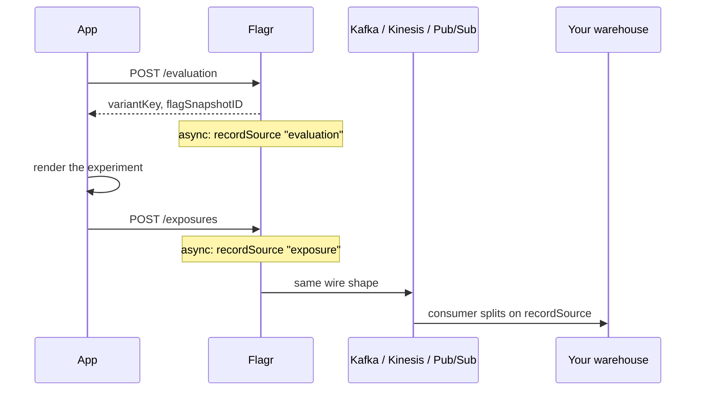
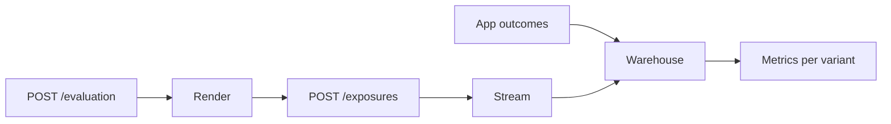

# Data recorders & A/B analysis

Flagr decides who gets which variant. That decision is only half the story - the other half is knowing what happened next. Recording is how Flagr turns each evaluation and each client-reported exposure into an event your warehouse can trust.

Flagr doesn't pick your streaming backend, and it doesn't run significance tests. It emits a **single wire shape** to whichever recorders you configure - Kafka, Kinesis, Pub/Sub, or in-process Datar - and gets out of the way. The analytics, the joins, the conversion math: that's yours.

| If you need… | Read |
|--------------|------|
| What "eval" vs "exposure" means | [Behavioral contracts](flagr_behavioral_contracts.md#eval-vs-exposure) |
| Segment stop / no rollout fallthrough | [behavioral contracts: segment evaluation](flagr_behavioral_contracts.md#segment-evaluation) |
| Blank `variantKey` vs stream row | [behavioral contracts: blank vs stream](flagr_behavioral_contracts.md#blank-vs-stream) |
| How to call eval / exposure from your app | [Integration guide](integration.md) |
| The exposure API itself | [Exposure logging](flagr_exposure.md) |
| Quick eval counts without a pipeline | [Datar analytics](flagr_datar.md) |
| Every recorder env var | [Environment variables](flagr_env.md#guide) |

## The lifecycle of an event

A user lands on your checkout page. Behind the scenes, a small chain of events fires - some synchronous, some not - and the way they fit together is the whole design.

1. **Your app calls `POST /evaluation`.** Flagr reads from in-memory EvalCache (no per-request SQL), walks segments in rank order per [segment evaluation](flagr_behavioral_contracts.md#segment-evaluation), and returns a `variantKey` plus a `flagSnapshotID`. This is the *assignment*.

2. **Your app renders the surface.** If `variantKey` is empty, it doesn't render the experiment - holdout, rollout miss, or no match, not a participant.

3. **Your app calls `POST /exposures`** when the user actually *sees* the treatment (on mount, in-viewport, or batched on unload). Flagr validates the row against EvalCache - it checks the flag exists and is enabled, resolves the variant if the client provided one - but it does **not** re-run segment constraints. The exposure is an impression, not a re-evaluation.

4. **Flagr enqueues asynchronously.** Both eval and exposure flow through the same `AsyncRecord` call, which fans out to every recorder in `FLAGR_RECORDER_TYPE`. The call returns immediately; a slow Kafka broker or a Kinesis hiccup never blocks the eval hot path.

5. **Your consumer splits on `recordSource`.** Every message carries either `"evaluation"` or `"exposure"` in one field. Your consumer parses the payload, routes accordingly, and lands exposure rows in a fact table. The outcomes (purchases, signups) come from *your* product analytics - Flagr never sees them.



The key insight: **evaluation** and **exposure** are different events with different meanings, but they share one wire format and one set of recorders. Your consumer doesn't maintain two parsers for two topics - it branches on a single field.

## What gets recorded (and what doesn't)

Rows reach a recorder only when all three [recording gates](flagr_behavioral_contracts.md#recording-gates) are open. Canonical blank-vs-stream table: [behavioral contracts](flagr_behavioral_contracts.md#blank-vs-stream). When gates are open:

| What the user triggered | `recordSource` | Streamed? | Why |
|-------------------------|----------------|-----------|-----|
| Eval - flag not found, disabled, or has no segments | - | **No** | Early return; no `logEvalResult` |
| Eval - no segment matched (empty variant) | `evaluation` | **Yes** | Evaluator ran; `segmentID` is `0` |
| Eval - constraints match, rollout / distribution yields no variant | `evaluation` | **Yes** | Same as no assignment; later segments did not run |
| Eval - variant assigned | `evaluation` | **Yes** | `segmentID` is the matched segment |
| Exposure - valid row, gates on | `exposure` | **Yes** | `segmentID` always `0` (no constraint re-eval) |
| Exposure - valid row, gates off | - | **No** | HTTP 200 with `loggedCount: 0` |
| Exposure - invalid row | - | **No** | Row error in the response; not enqueued |

A blank-variant eval row is useful for volume and "assigned but never exposed" gaps. For rigid A/B denominators, count exposures (people who saw the surface), not eval volume alone.

**Datar** follows the same gates but silently drops `exposure` rows - evaluations only. With `kafka,datar`, Kafka gets everything; Datar gets eval counts only.

After toggling `dataRecordsEnabled`, wait for EvalCache reload (~3s by default) - [EvalCache freshness](flagr_behavioral_contracts.md#evalcache-freshness).

## The wire format

Every message in your stream is a JSON object wrapping an `evalResult`. The wrapper has two shapes, controlled by `FLAGR_RECORDER_FRAME_OUTPUT_MODE`:

**`payload_string`** (default) - the inner `evalResult` is serialized to a JSON string:

```json
{
  "payload": "{\"evalContext\":{\"entityID\":\"user-123\",...},\"recordSource\":\"evaluation\",...}",
  "encrypted": false
}
```

**`payload_raw_json`** - the inner `evalResult` is embedded as a JSON object (no `encrypted` field):

```json
{
  "payload": {
    "evalContext": { "entityID": "user-123", "entityType": "user", "entityContext": { "country": "US" } },
    "flagID": 1,
    "flagKey": "checkout-button",
    "flagSnapshotID": 42,
    "segmentID": 10,
    "variantID": 2,
    "variantKey": "treatment",
    "timestamp": "2026-06-25T12:00:00Z",
    "recordSource": "evaluation"
  }
}
```

An **encrypted** mode (with `FLAGR_RECORDER_ENCRYPTED=true` and `FLAGR_RECORDER_ENCRYPTED_KEY`) replaces `payload` with base64 ciphertext and sets `encrypted: true`.

The **partition key** is `evalContext.entityID` - so all events for one user land in the same Kafka partition or Kinesis shard. Pub/Sub doesn't use a partition key but publishes the same bytes as the message body.

### Inner fields that matter for analytics

| Field | Evaluation | Exposure |
|-------|------------|----------|
| `recordSource` | `evaluation` | `exposure` |
| `evalContext.entityID` | From request | From request |
| `evalContext.entityContext` | Constraint input | Client context (page, etc.) - **not** re-validated |
| `flagID` / `flagKey` | Yes | Yes |
| `flagSnapshotID` | From the flag snapshot | From client (pass through from eval) |
| `segmentID` | Matched segment, or `0` | Always `0` |
| `variantID` / `variantKey` | If assigned | Optional; resolved from cache if provided |
| `timestamp` | RFC3339 | RFC3339 (client-supplied or server now) |

A full exposure example, same user five minutes later:

```json
{
  "payload": {
    "evalContext": {
      "entityID": "user-123",
      "entityType": "user",
      "entityContext": { "country": "US", "page": "/checkout" }
    },
    "flagID": 1,
    "flagKey": "checkout-button",
    "flagSnapshotID": 42,
    "segmentID": 0,
    "variantID": 2,
    "variantKey": "treatment",
    "timestamp": "2026-06-25T12:05:00Z",
    "recordSource": "exposure"
  }
}
```

Note the `page` key in `entityContext` - exposures can carry impression-specific context that evals don't. And `segmentID: 0` is the signal that no constraint re-evaluation happened.

## Setting up recorders

Flagr supports four recorder types, and you can combine them comma-separated in `FLAGR_RECORDER_TYPE`. One `AsyncRecord` call fans out to all of them.

| Recorder | Type string | Eval + exposure? | Good for |
|----------|------------|-------------------|----------|
| Kafka | `kafka` | Both | General streaming + warehouse A/B |
| Kinesis | `kinesis` | Both | AWS-native stacks |
| Pub/Sub | `pubsub` | Both | GCP-native stacks |
| Datar | `datar` | Eval only | Quick eval counts without a pipeline |

### Kafka + warehouse (the common path)

```bash
export FLAGR_RECORDER_ENABLED=true
export FLAGR_RECORDER_TYPE=kafka
export FLAGR_RECORDER_KAFKA_BROKERS=kafka1:9092,kafka2:9092
export FLAGR_RECORDER_KAFKA_TOPIC=flagr-records
export FLAGR_RECORDER_KAFKA_PARTITION_KEY_ENABLED=true   # default
```

Per flag:

```bash
curl -X PUT "http://flagr:18000/api/v1/flags/1" \
  -H 'Content-Type: application/json' \
  -d '{"dataRecordsEnabled": true}'
```

### Kafka + Datar (two audiences, one config)

```bash
export FLAGR_RECORDER_TYPE=kafka,datar
export FLAGR_RECORDER_DATAR_FLUSH_INTERVAL=60s
```

Data engineering consumes Kafka for warehouse A/B; PMs query `GET /api/v1/datar/flags/{flagID}/summary` for quick eval volume dashboards - no consumer to maintain.

### Kinesis

```bash
export FLAGR_RECORDER_ENABLED=true
export FLAGR_RECORDER_TYPE=kinesis
export FLAGR_RECORDER_KINESIS_STREAM_NAME=flagr-records
```

Same `DataRecordFrame` bytes; partition key is `entityID`.

### Pub/Sub

```bash
export FLAGR_RECORDER_ENABLED=true
export FLAGR_RECORDER_TYPE=pubsub
export FLAGR_RECORDER_PUBSUB_PROJECT_ID=my-project
export FLAGR_RECORDER_PUBSUB_TOPIC_NAME=flagr-records
```

Optional: `FLAGR_RECORDER_PUBSUB_KEYFILE` for a service account key (otherwise `GOOGLE_APPLICATION_CREDENTIALS`).

TLS, SASL, and all tuning knobs: [Environment variables - Data recorders](flagr_env.md#data-record-destinations).

## Consuming the stream

Kinesis and Pub/Sub publish the same outer JSON as Kafka - only the client library changes. Parse `payload` (it's a string in `payload_string` mode, an object in `payload_raw_json` mode), then branch on `recordSource`.

```python
#!/usr/bin/env python3
"""Minimal Flagr consumer - eval vs exposure on one topic."""
import json
import sys
from kafka import KafkaConsumer

TOPIC = "flagr-records"
BOOTSTRAP = ["localhost:9092"]


def parse_record(message_value: bytes) -> dict | None:
    outer = json.loads(message_value)
    payload = outer.get("payload")
    if isinstance(payload, str):
        return json.loads(payload)
    if isinstance(payload, dict):
        return payload
    return None


def main():
    consumer = KafkaConsumer(
        TOPIC,
        bootstrap_servers=BOOTSTRAP,
        auto_offset_reset="earliest",
        group_id="flagr-example-consumer",
    )
    for msg in consumer:
        record = parse_record(msg.value)
        if not record:
            continue
        source = record.get("recordSource") or "evaluation"
        ctx = record.get("evalContext") or {}
        entity_id = ctx.get("entityID")
        if source == "exposure":
            # Land in fact_exposure - your A/B denominator
            print("EXPOSURE", entity_id, record.get("flagKey"),
                  record.get("variantKey"), record.get("flagSnapshotID"), file=sys.stderr)
        elif source == "evaluation":
            # Debug / volume - not a denominator
            print("EVAL", entity_id, record.get("flagKey"),
                  "segment=", record.get("segmentID"), file=sys.stderr)


if __name__ == "__main__":
    main()
```

In production, use your org's stream processor (Flink, Spark, ksqlDB, Lambda) with the same `recordSource` branch - plus auth, dead-letter queues, and schema versioning.

## A/B analysis in the warehouse

This is where the recording pays off. The trustworthy A/B loop is two tables and one join: **exposures** (who saw which variant, and when) joined to **outcomes** (who did the thing you care about). Everything else - significance, Bayesian priors, sequential stopping - runs on top of that join.



**Exposure counts by variant** (the denominator):

```sql
SELECT variant_key, COUNT(DISTINCT entity_id) AS exposed_users
FROM fact_exposure
WHERE flag_key = 'checkout-button'
  AND event_date BETWEEN '2026-06-01' AND '2026-06-30'
GROUP BY variant_key;
```

**Conversion rate** (needs your outcome table):

```sql
WITH first_exposure AS (
  SELECT entity_id, variant_key, MIN(exposed_at) AS first_exposed_at
  FROM fact_exposure
  WHERE flag_key = 'checkout-button'
  GROUP BY entity_id, variant_key
),
conversions AS (
  SELECT user_id AS entity_id, MIN(converted_at) AS converted_at
  FROM fact_purchases
  GROUP BY user_id
)
SELECT
  e.variant_key,
  COUNT(DISTINCT e.entity_id) AS exposed,
  COUNT(DISTINCT c.entity_id) AS converted,
  COUNT(DISTINCT c.entity_id) * 1.0 / NULLIF(COUNT(DISTINCT e.entity_id), 0) AS conversion_rate
FROM first_exposure e
LEFT JOIN conversions c
  ON e.entity_id = c.entity_id
  AND c.converted_at >= e.first_exposed_at
  AND c.converted_at < e.first_exposed_at + INTERVAL '7 days'
GROUP BY e.variant_key;
```

Use **first exposure per entity per experiment** unless you're intentionally analyzing repeat views. Pass `flagSnapshotID` from eval through to exposures so analysis ties to the flag version active at impression time - not today's config.

Evaluation rows (`recordSource: evaluation`) have a legitimate role in the warehouse too: API volume monitoring, segment distribution checks, and the sanity check of "assigned but never exposed" - the gap that reveals integration bugs, ad blockers, or never-rendered paths.

## Troubleshooting

| Symptom | Check |
|---------|-------|
| No records in your stream | `FLAGR_RECORDER_ENABLED`, `FLAGR_RECORDER_TYPE`, broker/stream/topic config, flag `dataRecordsEnabled` |
| Eval works but stream is empty | Flag missing, disabled, or has no segments → no `evaluation` row is emitted by design |
| Stream has evals but no exposures | Client isn't calling `POST /exposures` - see [Integration guide](integration.md) |
| Exposures in stream but not in Datar | Expected - Datar counts evaluations only |
| Duplicate exposures in analysis | Dedupe on the client (once per session/view); warehouse `COUNT DISTINCT` or first-exposure logic |
| GDPR / deletion requests | `evalContext.entityID` is in every frame - handle it in your retention pipeline |
