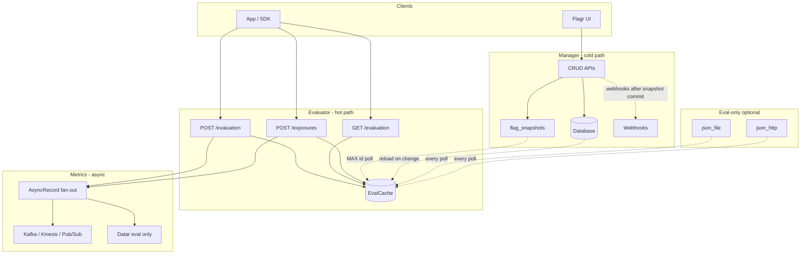

# Flagr overview

Every evaluation answers one question: **given this entity, which variant right now?**

Segments, constraints, distribution, and rollout are the machinery behind that answer. Evaluation is sticky for a stable `entityID` and an unchanged flag, and it runs from an in-memory **EvalCache**, not a SQL query on every request.

Field names and request shapes live in the [API reference](https://openflagr.github.io/flagr/api_docs). Handler layout and package map: [Contributing](CONTRIBUTING.md#where-the-code-lives). Integrator invariants (eval vs exposure, segment stop rules, blank vs stream, recording gates, cache lag): [Behavioral contracts](flagr_behavioral_contracts.md).

## Concepts

The smallest unit is a **flag**: a decision point in your app. Behind it sits the runtime question *who gets what?* One flag can be a kill switch, an experiment, or a config carrier. Same evaluation call either way.

Flags have a unique `key`. Set `enabled: false` and evaluation returns blank before segments run, a global off switch for that flag. **Tags** (`frontend`, `experiment`, `ops`, …) are labels for lookup and batch filters. They do not change evaluation math.

A flag returns a **variant**: one outcome (`control` / `treatment`, `on` / `off`, `green` / `blue`). Each variant can carry an **Attachment**, arbitrary JSON (`map[string]any`) for dynamic configuration. Clients branch on `variantKey` and read config from the attachment. In eval responses that field is `variantAttachment`.

> **Note:** "Variant Attachment" in these docs is the `Attachment` field on the `Variant` entity. There is no separate `VariantAttachment` type in the domain model.

The **entity** is who (or what) you evaluate:

| Field | Role |
|-------|------|
| `entityID` | Sticky identity. Same client-sent ID + same flag config → same bucket. |
| `entityType` | Label for logs and records (`user`, `device`, …). |
| `entityContext` | Free-form JSON. Constraints match against this map. |

If the client omits `entityID`, the evaluator injects a random id **before** bucketing. That request is non-sticky. Send a stable id when stickiness matters. See [behavioral contracts: segment evaluation](flagr_behavioral_contracts.md#segment-evaluation).

A **segment** is an audience slice: constraints joined by logical **AND**, plus rollout and distribution. Segments run in **rank order**. **Match means all constraints pass** (or the segment has no constraints). The first matching segment runs distribution + rollout, then evaluation **stops** - later segments never run, even if rollout yields no variant. A segment with no constraints matches everyone (catch-all). Full rule: [behavioral contracts: segment evaluation](flagr_behavioral_contracts.md#segment-evaluation).

A **constraint** is one comparison on `entityContext`, e.g. `state == "CA"`, `age >= 21`, nested paths like `user.tier`. One miss and the segment does not match; the entity falls through to the next segment.

**Distribution** splits a matched segment across variants (50/50 control/treatment, 100/0 for a pure rollout). **Rollout** is the percent of the hashed sub-range that receives the chosen variant. Low rollout on a matched segment can leave `variantKey` empty; that is intentional holdout, **not** a fallthrough to later segments.

### Constraint property access

Constraint `Property` supports dotted and bracketed paths into `entityContext`:

| Syntax | Resolves to |
|--------|-------------|
| `state` | `entityContext["state"]` |
| `user.name` | `entityContext["user"]["name"]` |
| `users[0]` | `entityContext["users"][0]` |
| `users[0].role` | `entityContext["users"][0]["role"]` |

Missing keys, out-of-bounds indices, and type mismatches mean **no match** for that segment, not an HTTP error. Negative indices work (`users[-1]` is the last element).

Server-side keys such as `@ts` and `@http_*` can be merged into `entityContext` before constraints run when injection is enabled. See [Built-in context injection](flagr_injected_context.md).

## Running example

The screenshots walk one flag from a simple rollout to geo-targeted segments and a full launch. Variants define outcomes, segments define *who*, constraints narrow the audience, distribution picks the variant, and rollout limits how much of a matched segment actually gets one.

**Setup** - three button-color variants (`green`, `blue`, `pink`):

**Step 1 - targeted rollout** - California only (`state == "CA"`), partial rollout:

**Step 2 - geo-specific rules** - more state segments; combine constraints (`state == "NY" AND age >= 21`):

**Step 3 - experiment, then launch** - A/B inside a segment, then raise rollout and pin a global winner:

## Rollout and deterministic bucketing

Stickiness does not require a per-user table. Flagr derives the bucket from the entity and a salt, then maps that bucket onto distribution ranges.

Source of truth: `pkg/entity/distribution.go` (`crc32Num`, `TotalBucketNum = 1000`). Salt is the flag's ID string (`SegmentEvaluation.FlagIDStr`), passed into `DistributionArray.Rollout` from `pkg/handler/eval.go`.

Given a **client-stable** `entityID` and a segment whose constraints already matched:

1. **Hash** - IEEE CRC32 of the salt, then updated with the entity ID bytes:  
   `crc32.ChecksumIEEE(salt)` → `crc32.Update(…, entityID)` → `sum % 1000`.  
   That yields a bucket in `[0, 999]`.
2. **Distribution** - variants occupy contiguous ranges in those 1000 buckets (from each variant's percent × 10). A 50/50 split is roughly buckets `0-499` vs `500-999`, depending on order and exact percents.
3. **Rollout** - applied **inside** the variant range the entity hashed into. At 100% rollout the variant always wins that range. Below 100%, some buckets in the range get **no assignment**. Evaluation does **not** continue to later segments; the request ends with an empty `variantKey`.

> **Note:** A low rollout on a matched segment can still produce an empty `variantKey`. That is intentional: rollout is not "percent of users who match constraints," it is "percent of the hashed sub-range that receives the chosen variant." Segment stop rules: [behavioral contracts](flagr_behavioral_contracts.md#segment-evaluation).

## Architecture

Three concerns, three latency budgets:

| Concern | Path | Consistency | Latency goal |
|---------|------|-------------|--------------|
| **Read** (evaluation) | `POST` / `GET /evaluation` | Stale-tolerant (cache refresh) | Sub-ms hot path |
| **Write** (configuration) | CRUD APIs + UI | Strong (database) | Rare; off the eval path |
| **Record** (analytics) | `AsyncRecord` fan-out | Best-effort async | Must not block eval |

When a diagram and the code disagree, **code wins**. Shared behavioral rules: [behavioral contracts](flagr_behavioral_contracts.md).

```mermaid
flowchart TB
  subgraph clients [Clients]
    App[App / SDK]
    UI[Flagr UI]
  end

  subgraph evaluator [Evaluator - hot path]
    Eval["POST /evaluation"]
    EvalGet["GET /evaluation"]
    Exp["POST /exposures"]
    EC[(EvalCache)]
    Eval --> EC
    EvalGet --> EC
    Exp --> EC
  end

  subgraph manager [Manager - cold path]
    CRUD[CRUD APIs]
    DB[(Database)]
    FS[flag_snapshots]
    WH[Webhooks]
    UI --> CRUD
    CRUD --> DB
    CRUD --> FS
    CRUD -. webhooks after snapshot commit .-> WH
  end

  subgraph metrics [Metrics - async]
    AR[AsyncRecord fan-out]
    Stream[Kafka / Kinesis / Pub/Sub]
    DT[Datar eval only]
    AR --> Stream
    AR --> DT
  end

  subgraph gitops [Eval-only optional]
    JF[json_file]
    JH[json_http]
  end

  App --> Eval
  App --> EvalGet
  App --> Exp
  Eval --> AR
  Exp --> AR
  FS -. MAX id poll .-> EC
  DB -. reload on change .-> EC
  JF -. every poll .-> EC
  JH -. every poll .-> EC
```

### How to read the diagram

- **Clients** call `POST` or `GET /evaluation` for assignment, and optionally `POST /exposures` for impressions ([Exposure logging](flagr_exposure.md), [behavioral contracts](flagr_behavioral_contracts.md#eval-vs-exposure)).
- **Evaluator** reads **EvalCache** only on the hot path. No per-request SQL.
- **Manager** owns CRUD and `flag_snapshot` rows; webhooks fire after commit.
- **Metrics** fan out async records to stream sinks or Datar. Slow sinks never block eval.

### Request flows

**Evaluation** - `POST` or `GET /api/v1/evaluation` ([GET evaluation](flagr_use_cases.md#get-evaluation-browser-friendly)) walks segments in rank order per [segment evaluation](flagr_behavioral_contracts.md#segment-evaluation), optionally emits `AsyncRecord` with `recordSource: evaluation`. Whether a blank result enqueues a stream row depends on the outcome: [blank vs stream](flagr_behavioral_contracts.md#blank-vs-stream).

**Configuration** - CRUD writes the DB and a snapshot. EvalCache reloads when `MAX(flag_snapshot.id)` advances, or on the poll interval (`FLAGR_EVALCACHE_REFRESHINTERVAL`, default **3s**).

**Exposure** - `POST /api/v1/exposures` validates against the cache (no constraint re-run) and records `recordSource: exposure`.

**Eval-only** - `json_file` / `json_http` drivers force eval-only mode: health, evaluation, and eval-cache export only. Details: [behavioral contracts: eval-only](flagr_behavioral_contracts.md#eval-only).

### Components

**Evaluator** - single eval, batch, tag-filtered batch; cache reload interval; snapshot max-id short-circuit in DB mode (`GET /api/v1/flags/snapshots/max_id` for external pollers). Code: `pkg/handler/eval.go`, `eval_cache.go`.

**Manager** - CRUD, **`POST /flags/{flagID}/duplicate`**, transactional mutations with snapshots. UI: **Duplicate Flag**, **Delete Flag**. Code: `pkg/handler/crud.go`.

**Metrics** - gated by [recording rules](flagr_behavioral_contracts.md#recording-gates). Wire format and A/B SQL: [Data recorders & A/B analysis](flagr_eval_exposure_pipeline.md).

## Related documentation

- [Behavioral contracts](flagr_behavioral_contracts.md)
- [Use cases](flagr_use_cases.md) - flags, experiments, dynamic config, GET eval
- [Integration guide](integration.md) - HTTP examples
- [Exposure logging](flagr_exposure.md) and [Data recorders & A/B analysis](flagr_eval_exposure_pipeline.md)
- [Datar analytics](flagr_datar.md)
- [Environment variables](flagr_env.md) - source of truth: `pkg/config/env.go`
