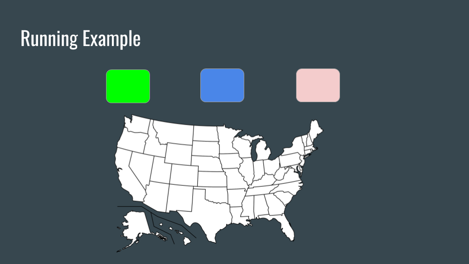
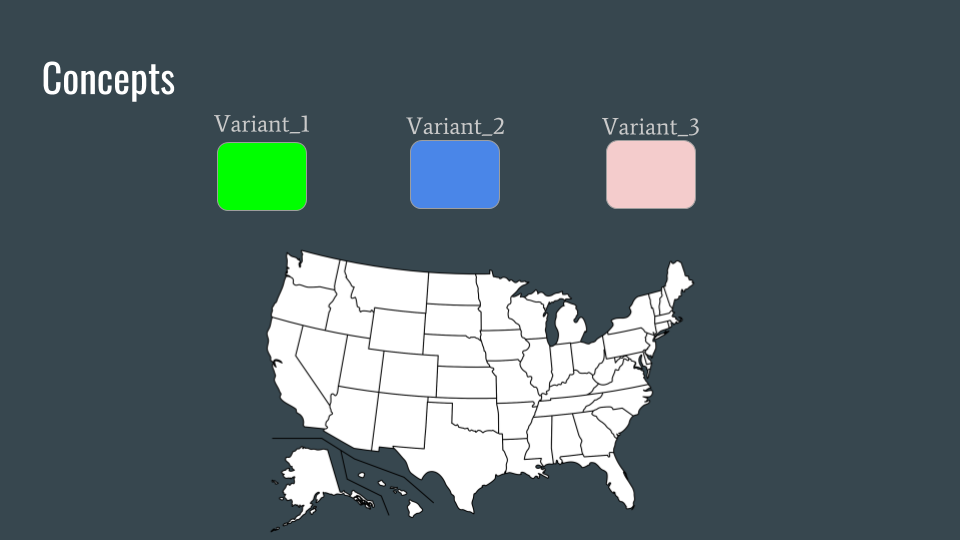
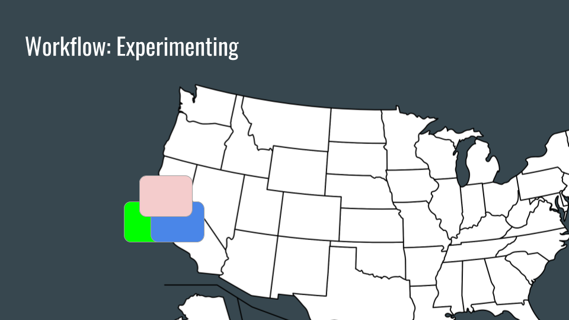
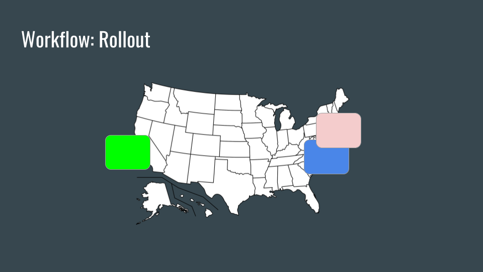
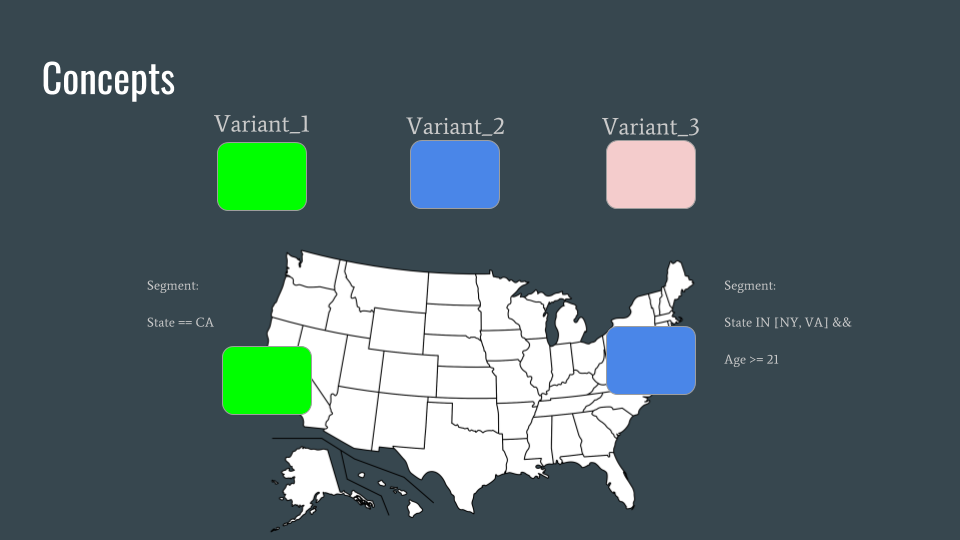
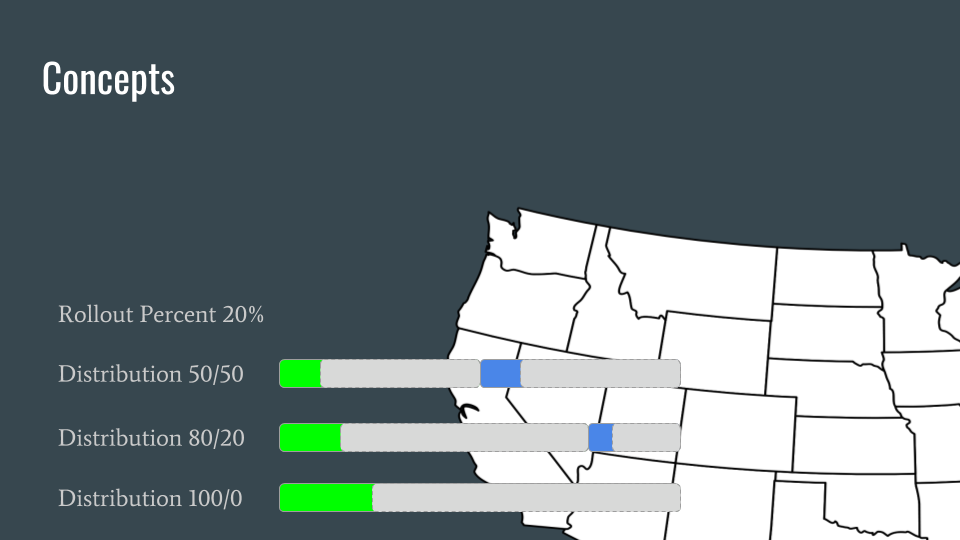
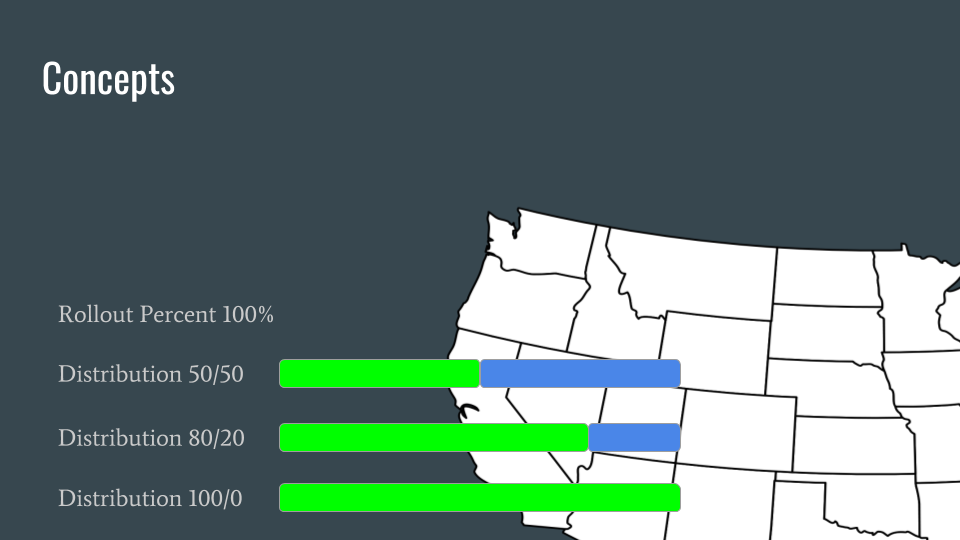
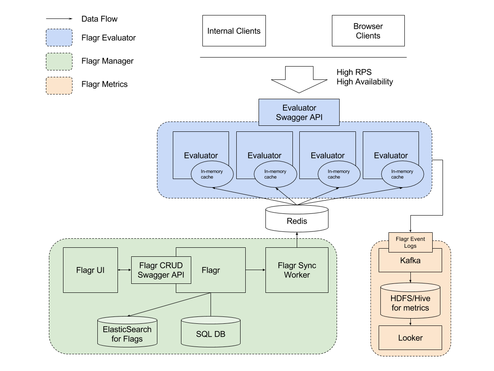

# Flagr Overview

Every evaluation in Flagr answers one question: *given this entity, which
variant should it get — right now?* The machinery behind that answer is
small, deterministic, and fast. This page explains the concepts that make up
that question, the algorithm that resolves it, and the architecture that
serves it at low latency.

## Concepts

For the authoritative field definitions, see the
[API doc](https://openflagr.github.io/flagr/api_docs).

- **Flag** — A decision point in your application. Behind it lives the question
  you want to answer at runtime: *who gets what?* A flag can act as a feature
  flag (on/off), an experiment (control vs. treatment), or a configuration
  (which JSON to serve). It is the top-level unit you evaluate against.
- **Tag** — A descriptive label attached to a flag for easy lookup and
  filtering. Tags let you group flags by team, surface, or lifecycle
  ("frontend", "experiment", "ops") without encoding that into the flag key.
- **Variant** — One possible outcome of a flag (`control`/`treatment`,
  `green`/`yellow`/`red`). Each variant carries an **Attachment** (an
  arbitrary JSON object) for dynamic configuration. The same variant mechanism
  that picks a button color can also carry the hex code, a copy string, or a
  timeout value — so the client never has to branch on business logic, only on
  the `variantKey`.
- **Segment** — The audience you want to target; the smallest unit you can
  analyze in Flagr Metrics. A segment is defined by a set of **Constraints**
  (connected by `AND`). Segments are evaluated in rank order, and an entity
  falls into the **first** segment that matches — so ordering is how you
  express "specific audiences first, everyone else last."
- **Constraint** — A rule on the entity context, e.g. `state == "CA"` or
  `age >= 21`. All constraints in a segment must match (`AND`). Constraints are
  what make a flag *targeted* rather than global — they let you say "only
  users in California, on mobile, over 21" without writing that logic in your
  app.
- **Distribution** — How matched entities are split across variants within a
  segment. A `50/50` split of `control`/`treatment` is the bread and butter of
  A/B testing; a `100/0` split is a rollout. Distribution turns a segment from
  a *who* into a *who gets which*.
- **Entity** — The context you evaluate against (`entityID`, `entityType`,
  `entityContext`). The `entityID` is what makes evaluation **deterministic**:
  the same ID always hashes to the same bucket, so a user sees the same variant
  on every request. Constraints read fields from `entityContext`.

> **Note:** "Variant Attachment" in these docs refers to the `Attachment` field
> on the `Variant` entity (type `map[string]any` — arbitrary JSON). There is no
> separate `VariantAttachment` type.

### Constraint property access

Constraint `Property` supports nested field access via dotted and bracketed
syntax against `entityContext`:

| Syntax | Resolves to |
|--------|-------------|
| `state` | `entityContext["state"]` (flat, as before) |
| `user.name` | `entityContext["user"]["name"]` |
| `users[0]` | `entityContext["users"][0]` |
| `users[0].role` | `entityContext["users"][0]["role"]` |

Missing keys, out-of-bounds indices, and type mismatches evaluate to
**no match** (the segment does not match) rather than erroring. Negative
indices are supported (`users[-1]` = last element).

## Running example

The best way to see how the concepts compose is to follow one flag through its
lifecycle — from a cautious rollout to a targeted experiment to a full launch.
Suppose we want to ship a new button to US users, but we don't yet know which
color works best. `green` / `blue` / `pink` are the three variants.

Start by exposing the flag to a small audience, e.g. users in California:

Later, learn that CA users like green, NY users like pink, DC users like blue —
so add three segments, each defined by `state == ?`. A segment can combine
multiple constraints, e.g. `state == "NY" AND age >= 21`:

To A/B test, split `green`/`blue` `50%/50%` (distribution) on `20%` (rollout)
of the CA segment. Raise rollout to `100%` later so every CA user gets green or
blue. To ship `100%` green to `100%` of users, set distribution `100%/0%`
green/blue and rollout `100%`.

## Rollout and deterministic bucketing

The defining property of a good feature-flag engine is **stickiness**: the
same user must see the same variant on every request, even across restarts,
redeploys, and load-balanced instances. Flagr achieves this without storing
any per-user state. Instead it derives the variant **deterministically** from
the entity ID, so the answer is reproducible anywhere the same flag
configuration is loaded.

Given an entity context, evaluation works as follows:

1. **Hash** — `crc32.ChecksumIEEE(flagIDString + entityID)`.
2. **Modulo 1000** — the hash mod `1000` (the total bucket count) gives a
   bucket in `[0, 999]`.
3. **Distribution** — variants occupy contiguous bucket ranges. A `50/50`
   split of control/treatment means buckets `0–499` → control, `500–999` →
   treatment.
4. **Rollout** — the rollout percentage truncates the variant's bucket range.
   Within the variant's range, only the first `rolloutPercent` of buckets
   receive the variant; the rest fall through to the next segment (or no match).

> **Note:** The rollout percentage is applied **within whichever variant's
> bucket sub-range the entity hashed into**, not to a specific variant's full
> range. This means a low rollout can cause a matched segment to still not
> assign a variant, letting evaluation continue to later segments.

## Architecture

Flagr separates the three things that have different scaling and consistency
needs: **reading** an evaluation (hot, frequent, must be fast and stale-tolerant),
**writing** a flag mutation (cold, rare, must be consistent), and **recording**
what happened (asynchronous, lossy-by-design, must not slow down the request).
Each lives in its own component so evaluation is never blocked by a database
write or a slow analytics pipeline.

Flagr has three components: **Evaluator**, **Manager**, and **Metrics**.

### Flagr Evaluator

The Evaluator is the hot path. It serves evaluation requests from an in-memory
**`EvalCache`** of all flags, segments, variants, constraints, distributions,
and tags — pre-parsed and ready for fast evaluation. Keeping the cache in
memory means evaluation never touches the database on the request path; the
database is only a source of truth for reloads.

- **Refresh** — the cache reloads periodically (default every **3s**, via
  `FLAGR_EVALCACHE_REFRESHINTERVAL`).
- **Snapshot short-circuit** — the reload skips work when no new
  `flag_snapshot` rows exist, because every mutation handler that changes
  evaluation data also creates a snapshot.
- **Version endpoint** — `GET /api/v1/flags/snapshots/max_id` returns the
  current max `flag_snapshot` id, a monotonically increasing version counter
  for the entire flag configuration. External caches (CDN, sidecar proxies,
  app-level caches) can poll this single endpoint and invalidate when the value
  changes — far cheaper than polling individual flag records.

### Flagr Manager

The CRUD gateway. All flag mutations happen here — create a flag, edit a
segment, reorder, change a distribution. Every mutation flows through the
Manager, which writes to the database and appends a `flag_snapshot` row. That
snapshot is what the Evaluator watches to know when to reload.

### Flagr Metrics

Evaluation is only half the story — to measure impact you need to record *what
happened*. Evaluation results and client-reported exposures
(`POST /api/v1/exposures`) flow through the same **data recorders** when
per-flag `dataRecordsEnabled` is on. Recording is **asynchronous** and
fan-out, so a slow Kafka broker never stalls the eval response.

- **Streaming recorders** — Kafka, AWS Kinesis, Google Pub/Sub (same wire
  format for eval and exposure rows).
- **Datar** — built-in eval-only aggregate; skips exposure rows.
- **Combine** — set `FLAGR_RECORDER_TYPE` to a comma-separated list
  (e.g. `kafka,datar`).

See [Data Recorders & A/B Analysis](flagr_eval_exposure_pipeline.md).

## Related documentation

- [Use Cases](flagr_use_cases.md) — instrument apps for flags, experiments, dynamic config
- [Exposure Logging](flagr_exposure.md) and [Data Recorders & A/B Analysis](flagr_eval_exposure_pipeline.md) — impressions and pipeline analytics
- [Datar](flagr_datar.md) — optional built-in eval counters
- [Environment Variables](flagr_env.md) — deployment and recorder configuration