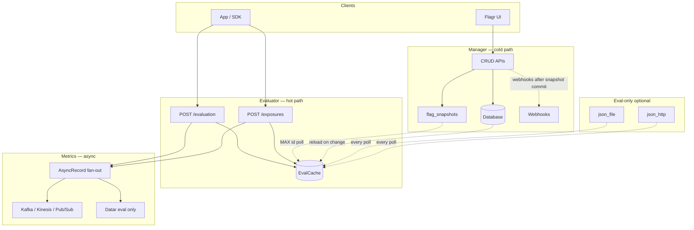

# Flagr Overview

Every evaluation in Flagr answers one question: *given this entity, which
variant should it get — right now?* The machinery behind that answer is
small, deterministic, and fast. This page explains the concepts that make up
that question, the algorithm that resolves it, and the architecture that
serves it at low latency.

## Concepts

For the authoritative field definitions, see the
[API doc](https://openflagr.github.io/flagr/api_docs).

- **Flag** — A decision point in your application. Behind it lives the question
  you want to answer at runtime: *who gets what?* A flag can act as a feature
  flag (on/off), an experiment (control vs. treatment), or a configuration
  (which JSON to serve). It is the top-level unit you evaluate against.
- **Tag** — A descriptive label attached to a flag for easy lookup and
  filtering. Tags let you group flags by team, surface, or lifecycle
  ("frontend", "experiment", "ops") without encoding that into the flag key.
- **Variant** — One possible outcome of a flag (`control`/`treatment`,
  `green`/`yellow`/`red`). Each variant carries an **Attachment** (an
  arbitrary JSON object) for dynamic configuration. The same variant mechanism
  that picks a button color can also carry the hex code, a copy string, or a
  timeout value — so the client never has to branch on business logic, only on
  the `variantKey`.
- **Segment** — The audience you want to target; the smallest unit you can
  analyze in Flagr Metrics. A segment is defined by a set of **Constraints**
  (connected by `AND`). Segments are evaluated in rank order, and an entity
  falls into the **first** segment that matches — so ordering is how you
  express "specific audiences first, everyone else last."
- **Constraint** — A rule on the entity context, e.g. `state == "CA"` or
  `age >= 21`. All constraints in a segment must match (`AND`). Constraints are
  what make a flag *targeted* rather than global — they let you say "only
  users in California, on mobile, over 21" without writing that logic in your
  app.
- **Distribution** — How matched entities are split across variants within a
  segment. A `50/50` split of `control`/`treatment` is the bread and butter of
  A/B testing; a `100/0` split is a rollout. Distribution turns a segment from
  a *who* into a *who gets which*.
- **Entity** — The context you evaluate against (`entityID`, `entityType`,
  `entityContext`). The `entityID` is what makes evaluation **deterministic**:
  the same ID always hashes to the same bucket, so a user sees the same variant
  on every request. Constraints read fields from `entityContext`.

> **Note:** "Variant Attachment" in these docs refers to the `Attachment` field
> on the `Variant` entity (type `map[string]any` — arbitrary JSON). There is no
> separate `VariantAttachment` type.

### Constraint property access

Constraint `Property` supports nested field access via dotted and bracketed
syntax against `entityContext`:

| Syntax | Resolves to |
|--------|-------------|
| `state` | `entityContext["state"]` (flat, as before) |
| `user.name` | `entityContext["user"]["name"]` |
| `users[0]` | `entityContext["users"][0]` |
| `users[0].role` | `entityContext["users"][0]["role"]` |

Missing keys, out-of-bounds indices, and type mismatches evaluate to
**no match** (the segment does not match) rather than erroring. Negative
indices are supported (`users[-1]` = last element).

## Running example

The screenshots below walk one flag from a simple rollout to geo-targeted
segments and a full launch. Each UI image maps to the concepts above: variants
define outcomes, segments define *who*, constraints narrow the audience,
distribution splits variants, and rollout limits what fraction of a matched
segment actually receives a variant.

**Setup** — three button-color variants (`green`, `blue`, `pink`) for a new
checkout experience:

**Step 1 — targeted rollout** — expose the flag to California users only
(`state == "CA"`), with a partial rollout before going wide:

**Step 2 — geo-specific preferences** — add segments per state (and combine
constraints, e.g. `state == "NY" AND age >= 21`):

**Step 3 — experiment then launch** — A/B within a segment (`50/50` green/blue
at `20%` rollout), then raise rollout and distribution to ship `100%` green
globally:

## Rollout and deterministic bucketing

The defining property of a good feature-flag engine is **stickiness**: the
same user must see the same variant on every request, even across restarts,
redeploys, and load-balanced instances. Flagr achieves this without storing
any per-user state. Instead it derives the variant **deterministically** from
the entity ID, so the answer is reproducible anywhere the same flag
configuration is loaded.

Given an entity context, evaluation works as follows:

1. **Hash** — `crc32.ChecksumIEEE(flagIDString + entityID)`.
2. **Modulo 1000** — the hash mod `1000` (the total bucket count) gives a
   bucket in `[0, 999]`.
3. **Distribution** — variants occupy contiguous bucket ranges. A `50/50`
   split of control/treatment means buckets `0–499` → control, `500–999` →
   treatment.
4. **Rollout** — the rollout percentage truncates the variant's bucket range.
   Within the variant's range, only the first `rolloutPercent` of buckets
   receive the variant; the rest fall through to the next segment (or no match).

> **Note:** The rollout percentage is applied **within whichever variant's
> bucket sub-range the entity hashed into**, not to a specific variant's full
> range. This means a low rollout can cause a matched segment to still not
> assign a variant, letting evaluation continue to later segments.

## Architecture

Flagr separates three concerns that scale differently:

| Concern | Path | Consistency | Latency goal |
|---------|------|-------------|--------------|
| **Read** (evaluation) | `POST /evaluation` | Stale-tolerant (cache refresh) | Sub-ms hot path |
| **Write** (configuration) | CRUD APIs + UI | Strong (database) | Rare, not on eval path |
| **Record** (analytics) | `AsyncRecord` fan-out | Best-effort async | Must not block eval |

The diagrams below cover **database-backed** deployments (default) and
**eval-only** JSON sources. They are **maintainer diagrams** aligned with the
Go implementation (not generated from the old `flagr_arch.png`). When the
diagram and code disagree, **code wins** — update this page.

**Implementation map:** `pkg/handler` (`handler.go`, `eval.go`, `eval_cache.go`,
`exposure.go`, `data_recorder*.go`), `pkg/entity/flag_snapshot.go`,
`pkg/config/config.go` (eval-only drivers). **Tests that encode the contract:**
`TestReloadMapCacheShortCircuit`, `TestRecordCountsTowardDatar`,
`TestAllMutationHandlersCallSaveFlagSnapshot` in `pkg/handler/`.

Three logical components implement the read / write / record split:

```mermaid
flowchart TB
  subgraph clients [Clients]
    App[App / SDK]
    UI[Flagr UI]
  end

  subgraph evaluator [Evaluator — hot path]
    Eval["POST /evaluation"]
    Exp["POST /exposures"]
    EC[(EvalCache)]
    Eval --> EC
    Exp --> EC
  end

  subgraph manager [Manager — cold path]
    CRUD[CRUD APIs]
    DB[(Database)]
    FS[flag_snapshots]
    WH[Webhooks]
    UI --> CRUD
    CRUD --> DB
    CRUD --> FS
    CRUD -. webhooks after snapshot commit .-> WH
  end

  subgraph metrics [Metrics — async]
    AR[AsyncRecord fan-out]
    Stream[Kafka / Kinesis / Pub/Sub]
    DT[Datar eval only]
    AR --> Stream
    AR --> DT
  end

  subgraph gitops [Eval-only optional]
    JF[json_file]
    JH[json_http]
  end

  App --> Eval
  App --> Exp
  Eval --> AR
  Exp --> AR
  FS -. MAX id poll .-> EC
  DB -. reload on change .-> EC
  JF -. every poll .-> EC
  JH -. every poll .-> EC
```

> **Eval-only** (`json_file` / `json_http`): no UI/CRUD path, no exposures, no
> `flag_snapshots` — configuration flows only from JSON into **EvalCache**.

### How to read the diagram

- **Clients / SDKs** call evaluation and (optionally) exposure APIs. Treat
  evaluation as *assignment* and exposures as *impression* for experiments —
  see [Exposure Logging](flagr_exposure.md).
- **Evaluator** does not query the database per request; it uses in-memory
  **EvalCache** (flags, segments, variants, constraints, distributions, tags).
- **Manager** persists configuration changes and appends **`flag_snapshot`** rows
  (webhooks may fire after commit).
- **Metrics** receives `evalResult` asynchronously; streaming recorders accept
  both `evaluation` and `exposure` rows; **Datar** counts evaluations only.

### Request flows

**Evaluation (hot path)** — `POST /api/v1/evaluation` → **EvalCache** → segments
in rank order → variant response → optional `AsyncRecord` (`recordSource:
evaluation`). No record when flag is missing, disabled, or has no segments.

**Configuration (cold path)** — CRUD → DB → `SaveFlagSnapshot` → on next poll,
**EvalCache** reloads if `MAX(flag_snapshot.id)` changed.

**Exposure** — `POST /api/v1/exposures` after render; validates against
**EvalCache** (no constraint re-eval) → `AsyncRecord` (`recordSource: exposure`).

### Components

**Evaluator** — `POST /evaluation`, batch eval, tag eval; refresh interval
`FLAGR_EVALCACHE_REFRESHINTERVAL` (default 3s); version probe
`GET /api/v1/flags/snapshots/max_id`.

**Manager** — CRUD for flags, segments, variants, constraints, distributions,
tags; not on the eval request path.

**Metrics** — `FLAGR_RECORDER_ENABLED` + per-flag `dataRecordsEnabled`; combine
backends via `FLAGR_RECORDER_TYPE` (e.g. `kafka,datar`). Details:
[Data Recorders & A/B Analysis](flagr_eval_exposure_pipeline.md).

### Eval-only mode (JSON flag sources)

When `FLAGR_DB_DBDRIVER` is `json_file` or `json_http`, Flagr exposes health +
evaluation only (no CRUD, exposures, Datar APIs, or eval-cache export). JSON is
re-fetched every poll with no snapshot short-circuit. See
[JSON Flag Source](flagr_json_flag_spec.md).

## Related documentation

- [Use Cases](flagr_use_cases.md) — instrument apps for flags, experiments, dynamic config
- [Exposure Logging](flagr_exposure.md) and [Data Recorders & A/B Analysis](flagr_eval_exposure_pipeline.md) — impressions and pipeline analytics
- [Datar](flagr_datar.md) — optional built-in eval counters
- [Environment Variables](flagr_env.md) — deployment and recorder configuration