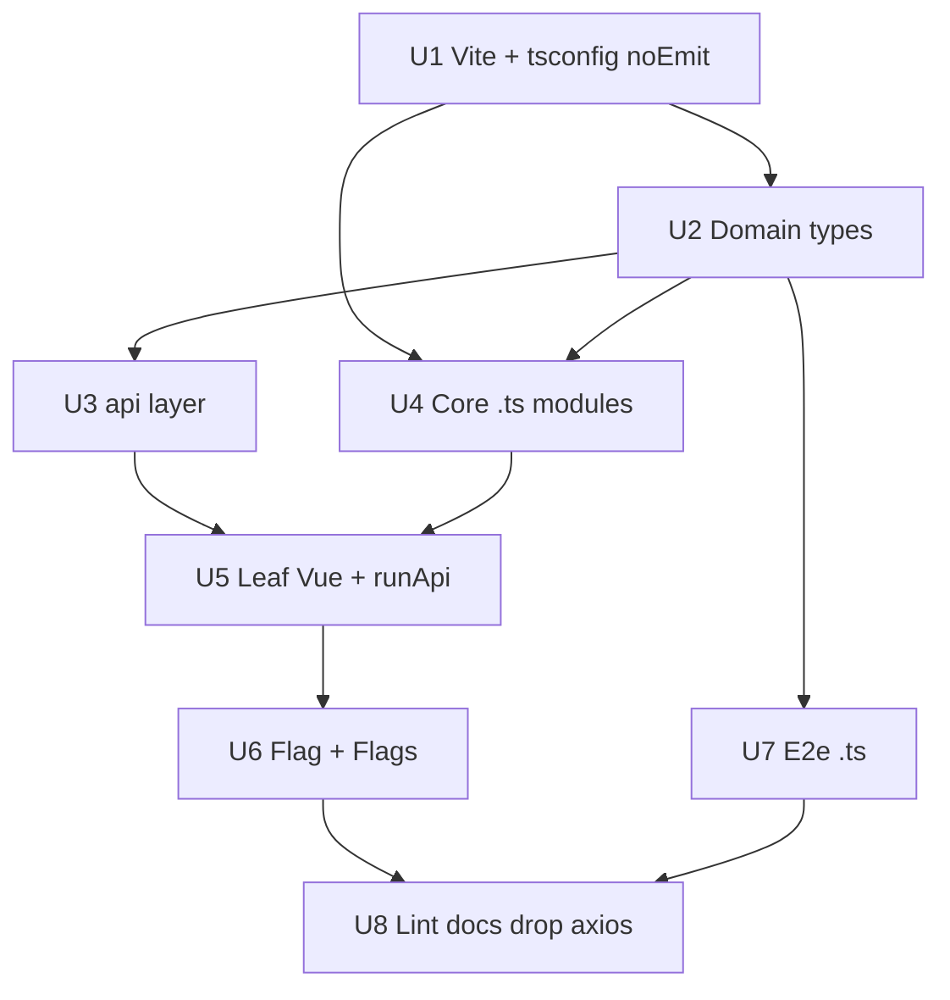

# refactor: Migrate Flagr UI from JavaScript to TypeScript

**Date:** 2026-06-26  
**Status:** implemented on branch `feat/flagr-ui-typescript-effect` (PR #721)  
**Canonical context:** Use **this plan** for what the PR changed and how flagr-ui is structured today. `AGENTS.md` stays a short pointer here.

---

## As-built (current stack)

### What shipped

- **TypeScript** across `browser/flagr-ui/src/` and `e2e/`; **Vite** compiles; **`vue-tsc --noEmit`** is the type gate (`make flagr-ui-check`).
- **axios removed**; REST via **`fetch`** in `src/api/http.ts`.
- **Typed errors:** `ApiError` classes + **`ApiResult<T>`** (`src/api/result.ts`). No Effect runtime (dependency removed).
- **UI boundary:** `helpers/runApi.ts` — `runApi(vm, promise, options)`, `confirmAndRunApi`, toasts, 401 redirect from `WWW-Authenticate`.
- **Domain:** `src/api/types.ts`, normalization `helpers/flagModel.ts`.
- **Orchestration:** `pages/flagPage.ts` (~430 lines, monolithic by choice), `pages/flagsListPage.ts`, list cache `pages/flagsList.ts`.
- **Vue:** Options API + `lang="ts"`. Templates call **`flagPage.*(page)`** / **`flagsListPage.*(page)`**; computed **`page`** = `castFlagPage(this)` / `castFlagsList(this)` (`helpers/vuePageCast.ts`). Presentational: `FlagHistory`, `DebugConsole`.
- **Tests:** Vitest `src/api/http.test.ts`, `flags.test.ts`; Playwright `e2e/*.spec.ts` (`make test-e2e`).

### Layer diagram

```text
Flag.vue / Flags.vue  →  pages/flagPage.ts | flagsListPage.ts  →  api/*  →  http.ts
         ↓ runApi(promise)                                              ↓
    helpers/runApi.ts                                              ApiResult<T>
```

### Rules for new code

1. **`api/*`** — functions return `Promise<ApiResult<T>>`; use `requestJson` / `requestVoid`. Multi-step flows (e.g. `listFlagsIfStale`, `loadFlagPageContext`, `createTagAndRefreshAllTags`, `deleteTagAndReload`) live in `api/flags.ts`.
2. **Pages** — take `FlagPageVm` / `FlagsListVm`; every exported handler starts with `vm` (local-only edits may use `_vm`); call `runApi` / `confirmAndRunApi` only; no `fetch` in `.vue` files.
3. **SFCs** — expose `flagPage` / `flagsListPage` on `data`; use computed `page`; no pass-through wrapper methods for every handler.
4. **New endpoints** — add to `api/flags.ts` or `api/evaluation.ts` → page handler → template wire.
5. **Do not** split `flagPage.ts` into submodules unless explicitly requested.

### Verification

| Gate | Command |
|------|---------|
| Lint + types + unit | `make flagr-ui-check` |
| Browser regression | `make test-e2e` |
| Production UI bundle | `make build-ui` |

### Related docs

- Reviewer checklist: `docs/review/feat-flagr-ui-typescript-effect.md`
- Short repo pointer: `AGENTS.md` (Frontend section)

---

## Problem frame (why we migrated)

Catch UI regressions at **typecheck** time, not only in e2e/runtime ([#720](https://github.com/openflagr/flagr/pull/720)-class bugs). Replace axios + `handleErr` with one typed error channel and typed view models (`FlagView`, `require*Id` guards).

**Success criteria (met):** no `.js` under `src/` / `e2e/`; Vite-only build; `make test-e2e` unchanged UX; REST only through `src/api/`; `vue-tsc` strict on app code.

---

## Historical note

The sections below describe the **original 2026-06-26 phased plan**, including a short-lived **Effect-TS** experiment in the PR branch. **As-built** supersedes them: Effect was removed in favor of `ApiResult` + async `fetch`. Keep the units for archaeology only.

## Implementation Units

### U1. Vite-first TypeScript baseline

**Goal:** Vite transpiles TypeScript in dev and build; `tsconfig` is editor + typecheck only (`noEmit`).

**Dependencies:** None

**Files:**

- `browser/flagr-ui/package.json` (modify — `typescript`, `vue-tsc`, `@vue/tsconfig`, `effect`, `@effect/platform`; scripts)
- `browser/flagr-ui/tsconfig.json` (create — `"noEmit": true`, `"moduleResolution": "bundler"`, extends `@vue/tsconfig/tsconfig.dom.json`)
- `browser/flagr-ui/src/env.d.ts` (create)
- `browser/flagr-ui/vite.config.mjs` (modify — `.ts` in `resolve.extensions` only; no `vite-plugin-checker` required at first)
- `browser/flagr-ui/index.html` (modify — `/src/main.ts` when entry renamed in U3)

**Approach:**

- **Do not** add a `tsc` build step or emit `dist` from TypeScript compiler—[Vite handles TS](https://vite.dev/guide/features#typescript) via esbuild.
- `npm run build` = `vite build`; `npm run typecheck` = `vue-tsc --noEmit` (CI/editor gate).
- `skipLibCheck: true` acceptable for speed; keep `strict: true` in app code.
- Install `effect` + `@effect/platform` early so tree-shaking includes only used modules in the Vite bundle.
- Entry rename to `main.ts` lands in U3; U1 may keep `main.js` until then if that keeps the first PR smaller.

**Test scenarios:**

- Happy path: `npm run build` succeeds (JS or TS entry).
- Happy path: after U3, `npm run dev` HMR works on `.ts` and `.vue` changes without restarting `tsc`.
- Edge case: `import.meta.env` typed in `env.d.ts`.

**Verification:** `npm install && npm run build` in `browser/flagr-ui`.

---

### U2. Domain types (type-safety core)

**Goal:** Types drive API contracts and UI state—not annotations after the fact.

**Dependencies:** U1

**Files:**

- `browser/flagr-ui/src/types/flag.ts` — `Flag`, `Variant`, `Segment`, `Constraint`, `Distribution`, `Tag`; `FlagView` / `SegmentView` for UI-only fields
- `browser/flagr-ui/src/types/evaluation.ts` — eval + batch types used by `DebugConsole`
- `browser/flagr-ui/src/types/operators.ts` — `OperatorValue` union from `operators.json`
- `browser/flagr-ui/src/types/index.ts` — re-exports (no Vue imports)

**Approach:**

- Mirror `swagger_gen/models/`; document source path in file header.
- Use **discriminated unions** where UI branches (e.g. constraint operator + value shapes).
- Optional: `effect/Schema` decoders in `src/api/decode.ts` for `Flag` and evaluation responses—decode once at the HTTP boundary so components receive narrowed types.
- `operators.json`: `as const` + `satisfies` pattern for literal operator keys.

**Test scenarios:**

- Happy path: `strict` compile with zero `any` in exported `types/*`.
- Edge case: `attachment?: Record<string, unknown>` on variants aligns with JsonEditor.

**Verification:** `npm run typecheck` after wiring a smoke import from `types/index`.

---

### U3. Effect API layer (errors + HTTP)

**Goal:** Centralize REST I/O as `Effect.Effect<A, ApiError>` programs; one UI presenter for all failures.

**Dependencies:** U1, U2

**Files:**

- `browser/flagr-ui/src/api/errors.ts` — `Data.TaggedError` variants: `ApiHttpError` (status, body message), `ApiUnauthorized` (redirect URL), `ApiNetworkError`, `ApiDecodeError`
- `browser/flagr-ui/src/api/client.ts` — base URL from `constants`, `FetchHttpClient` / `@effect/platform` `HttpClient` layer
- `browser/flagr-ui/src/api/decode.ts` (optional) — Schema decode to `Flag`, lists, evaluation DTOs
- `browser/flagr-ui/src/api/flags.ts` — list, get, create, update, delete, restore, snapshots, tags, variants, segments, constraints, distributions (mirror current axios endpoints)
- `browser/flagr-ui/src/api/evaluation.ts` — single + batch eval
- `browser/flagr-ui/src/ui/presentApiError.ts` — maps `ApiError` → Element Plus toast + 401 redirect (replaces `handleErr`)
- `browser/flagr-ui/src/ui/runApi.ts` — `runApi(vm, program, { onSuccess?, successMessage? })` using `Effect.runPromise` and `presentApiError` on failure

**Approach:**

- Implement endpoints incrementally behind the same function names the UI will call (`listFlags`, `getFlag`, `createFlag`, …).
- **Bridge phase (optional):** wrap axios in `Effect.tryPromise` per endpoint only until fetch client parity—then delete bridge in a follow-up commit within this migration.
- Use `Effect.gen` for multi-step flows (e.g. fetch max snapshot id then list flags) in `Flags.vue` cache logic—move that composition into `api/flags.ts` as `listFlagsWithCacheHint` if it clarifies types.
- `presentApiError`: `Match.valueTags` on `ApiError` for user-visible strings; preserve `'request error'` fallback and `www-authenticate` parsing.
- Delete `handleErr` from `helpers.js` once call sites use `runApi` (do not port `handleErr` to TS).

**Test scenarios:**

- Happy path: `listFlags` returns `readonly Flag[]` typed.
- Error path: 4xx/5xx → `ApiHttpError` with message from JSON body.
- Error path: 401 + authenticate header → redirect (manual or e2e).
- Edge case: malformed JSON body → `ApiDecodeError` toast.

**Verification:** Unit-level smoke: run one program from a tiny `api/smoke.ts` or dev-only button; then wire one screen in U6.

---

### U4. Core modules (`constants`, `router`, `main`, pure helpers)

**Goal:** Remove `.js` from `src/` entry tree; keep **non-API** helpers only (`pluck`, `sum`, `debounce`).

**Dependencies:** U1, U2

**Files:**

- `browser/flagr-ui/src/constants.ts` (delete `constants.js`)
- `browser/flagr-ui/src/router/index.ts` (delete `router/index.js`)
- `browser/flagr-ui/src/main.ts` (delete `main.js`)
- `browser/flagr-ui/src/helpers/helpers.ts` — **no** `handleErr` (delete `helpers.js`)
- `browser/flagr-ui/index.html` → `/src/main.ts`

**Approach:**

- Typed route names: `export type AppRouteName = 'home' | 'flag'`.
- `debounce` generic: `<T extends (...args: never[]) => void>(fn: T, delay: number) => ...`.
- Vite resolves `.ts` without explicit extensions in imports.

**Test scenarios:**

- Happy path: dev server boots; hash routes work.
- Happy path: `npm run build` + `npm run typecheck`.

**Verification:** Manual home route; `npm run build`.

---

### U5. Leaf Vue SFCs — `lang="ts"` + Effect where they call API

**Goal:** Type props/emits; route API calls through `runApi` / `api/*`.

**Dependencies:** U3, U4

**Files:**

- `App.vue`, `Spinner.vue`, `DistributionDialog.vue`, `FlagConfigCard.vue`, `MarkdownEditor.vue`, `VariantsSection.vue`, `SegmentsSection.vue`, `FlagHistory.vue`, `DebugConsole.vue`

**Approach:**

- `<script lang="ts">`; `defineComponent` + `PropType` on boundary components.
- `DebugConsole` / `FlagHistory`: use `api/evaluation.ts`, `api/flags.ts` snapshots—no direct axios.
- JsonEditor: `Record<string, unknown>` at edge; validation flags stay in component data with explicit types.
- `DistributionDialog`: keep `pluck`/`sum` from typed helpers.

**Test scenarios:**

- Happy path: flag detail sections render; debug eval succeeds (e2e).
- Edge case: invalid variant attachment blocks save (same UX).

**Verification:** `npm run typecheck`; relevant e2e specs.

---

### U6. Orchestrators (`Flags.vue`, `Flag.vue`) — typed state + Effect

**Goal:** Fully typed view models; **zero** axios in these files; module cache typed.

**Dependencies:** U5

**Files:**

- `browser/flagr-ui/src/components/Flags.vue`
- `browser/flagr-ui/src/components/Flag.vue`
- `browser/flagr-ui/src/lib/normalizeFlag.ts` (extract `normalizeFlag` / `normalizeSegment` for testability + types)

**Approach:**

- `data()` typed via `defineComponent` generics or explicit return interface.
- `flagsCache`: `{ flags: Flag[]; maxSnapshotID: number } | null` at module scope.
- Every mutation method: `void this.runApi(flagsApi.updateFlag(...), { onSuccess: () => ... })` pattern (thin method on component delegating to `runApi`).
- `normalizeFlag(api: Flag): FlagView` lives outside SFC; compiler enforces field coverage when types change.

**Test scenarios:**

- Happy path: full flag CRUD e2e path unchanged.
- Error path: failed save shows same toast via `presentApiError`.
- Edge case: variant delete guard when used in distribution.

**Verification:** `make test-e2e`; `npm run typecheck`.

---

### U7. Playwright e2e TypeScript

**Goal:** `.spec.ts` + typed helpers; share `src/types` only.

**Dependencies:** U2

**Files:**

- `e2e/helpers.ts`, `e2e/*.spec.ts`; delete `.js` counterparts
- `tsconfig.json` include `e2e/**/*.ts`

**Approach:**

- Helpers stay `fetch`-based throws OR thin `Effect.runPromise`—avoid bundling full `api/` unless it reduces duplication.
- Return types: `Promise<Flag>` etc. from shared types.

**Verification:** `make test-e2e`.

---

### U8. ESLint, docs, remove axios from app code

**Goal:** Lint TS; document Vite + Effect conventions; drop unused `axios` dependency when no imports remain.

**Dependencies:** U6, U7

**Files:**

- `eslint.config.mjs`, `package.json`, `AGENTS.md`

**Approach:**

- AGENTS.md: `npm run typecheck`, note `src/api` + Effect error model, “Vite compiles TS—do not add tsc emit”.
- ESLint: TS parser for `.ts`; Vue SFC script TS via `vue-eslint-parser`.
- Remove `axios` from `dependencies` if U3 fetch path complete.

**Verification:** `npm run lint && npm run typecheck && npm run build && make test-e2e`.

---

## High-Level Technical Design



**UI ↔ API boundary:**

```
Component / template
  → flagPage.putFlag(page) in pages/flagPage.ts
       → runApi(vm, flagsApi.updateFlag(...), { onSuccess })
            → promise → ApiResult → toast or presentApiError
```

**Suggested commit order:** U1 → U2 → U3 → U4 → U5 → U6 → U7 → U8 (U3 before U5 so `runApi` exists when SFCs migrate).

## Risks & Dependencies

| Risk | Mitigation |
|------|------------|
| `Flag.vue` typing breaks subtle normalization | Keep normalize functions; add unit-level type tests only if needed; rely on e2e |
| Element Plus `$message` typing in Options API | Use `ComponentPublicInstance` helpers or thin `methods.onApiError` |
| JsonEditor / attachment `any` | Narrow over time; document in types |
| Drift vs `swagger_gen/models` | Comment in `types/flag.ts` pointing to swagger models; update on API changes |
| E2e imports pulling Vue into tsc | Keep `types/*.ts` free of Vue imports |

## Open Questions

- Fetch-only API layer (done).
- `npm run typecheck` in Makefile before e2e? (Recommended after U8.)

## Sources & Research

- Inventory: `browser/flagr-ui` — 8 `.js` files, 11 Vue SFCs (Options API), configs `vite.config.mjs`, `eslint.config.mjs`, `playwright.config.mjs`
- API shape reference: `swagger_gen/models/flag.go` and related entity models
- Existing dependency: `vue3-ts-jsoneditor` (already in `package.json`)

## Test Strategy (end-to-end)

| Phase | Command |
|-------|---------|
| After U3 | `npm run dev` + manual home route |
| After U5–U6 | `npm run typecheck` |
| After U7 | `make test-e2e` |
| Release gate | `make build-ui` and `make test-e2e` (from repo root; see `make help`) |