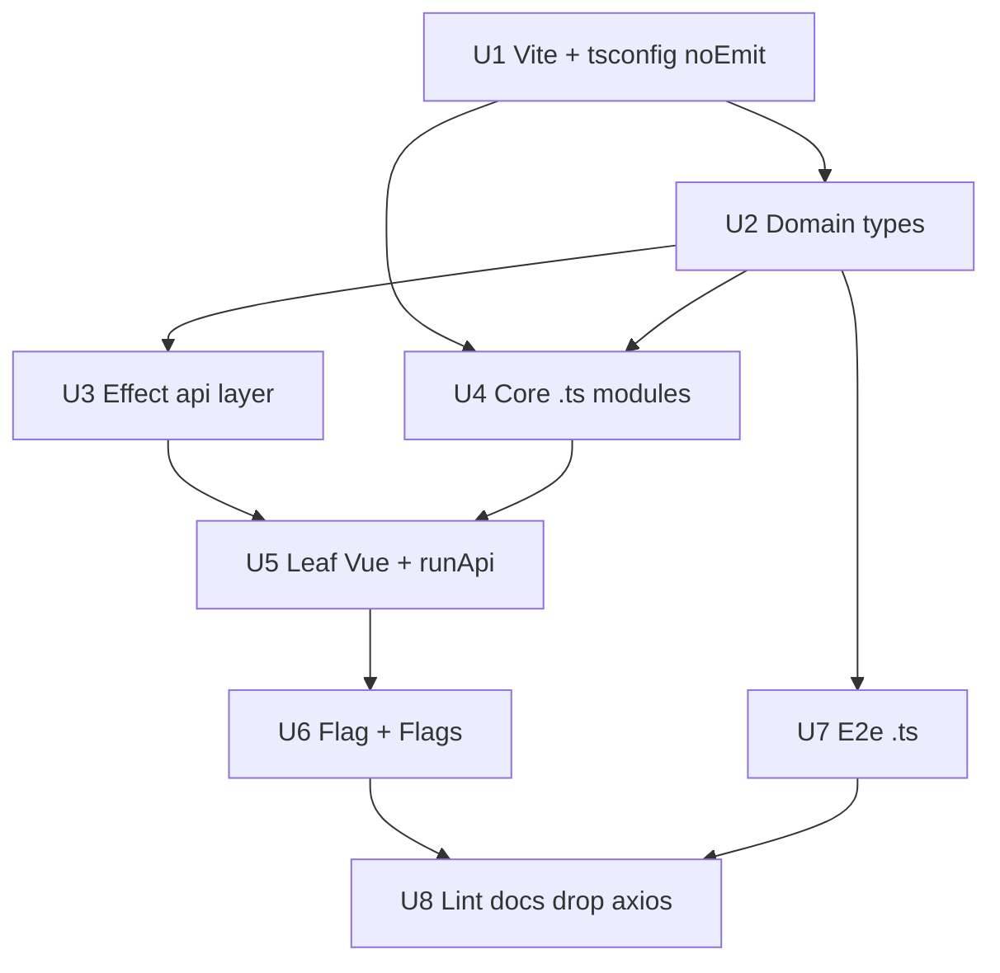

# refactor: Migrate Flagr UI from JavaScript to TypeScript

**Date:** 2026-06-26  
**Status:** implemented (merged path: `feat/flagr-ui-typescript-effect` / PR #721)

**As-built:** Domain types in `src/api/types.ts`; normalization in `helpers/flagModel.ts`; orchestration in `pages/flagPage.ts` + `pages/flagsListPage.ts` (module cache in `pages/flagsList.ts`); `fetch` + Effect in `api/http.ts` (axios removed); repo commands via **`make help`** (`build-ui`, `test-e2e`). Deep Effect guide: `browser/flagr-ui/docs/EFFECT.md`.

Add TypeScript to `browser/flagr-ui` with **Vite as the only compile path** (esbuild transpile; no `tsc` emit for builds). Rename application and e2e `.js` to `.ts`, type Vue SFCs for **real type safety** (domain types, branded IDs, typed API results), and replace scattered axios `.then` / `handleErr` with the **[Effect](https://effect.website)** library (`effect` on npm) for failures as typed, composable `Effect` programs. Options API stays; migration stays phased with green `build`, `typecheck`, and e2e after each unit.

## Problem Frame

**Primary motivation:** Catch UI regressions **before runtime and e2e**, not only after users or Playwright hit them. Recent example: [#720](https://github.com/openflagr/flagr/pull/720) — Distribution **Edit** failed with a `ReferenceError` because `clone(d)` remained after the lodash removal; ASI risk around `{}` + `.forEach` was another foot-gun. In untyped JS those failures surface only when a segment already has distributions. **TypeScript** (`vue-tsc`, strict props/state) and **typed API/view models** (`api/types.ts`, `helpers/flagModel.ts`) push that class of bug to **edit/CI time** (`make build-ui`). The **Effect** layer adds a typed error channel so REST and composition mistakes are visible in signatures, not as silent axios/`handleErr` drift.

- The UI was entirely JavaScript: four `src` modules, four e2e files, eleven Vue SFCs with plain `<script>`, and no `tsconfig`.
- API payloads and normalization were implicit; failures were ad hoc axios callbacks and `handleErr.bind(this)`—no typed error channel.
- `vue3-ts-jsoneditor` is already typed but consumed from untyped Options API components.

**Success criteria:**

1. No `.js` files remain under `browser/flagr-ui/src/` or `browser/flagr-ui/e2e/` (configs may stay `.mjs`).
2. `npm run dev` / `npm run build` use Vite only; TypeScript is stripped/transpiled by Vite (no parallel `tsc` build).
3. `npm run typecheck` (`vue-tsc --noEmit`) is the separate correctness gate—not part of the Vite bundle pipeline.
4. `make test-e2e` passes with unchanged UX (toasts, 401 redirect, validation messages).
5. REST calls go through a typed **`src/api/` Effect layer**; components do not call `axios` directly after migration.
6. Exported domain types cover API + UI view models; JSON boundaries use narrow types or Schema decode where high value.

## Key Technical Decisions

1. **Vite owns compilation** — `vite build` / `vite dev` transpile `.ts` and `<script lang="ts">` via esbuild. `tsconfig.json` exists for the editor and `vue-tsc --noEmit` only: set `"noEmit": true`, use `@vue/tsconfig` with `"moduleResolution": "bundler"`, and avoid a second emit step or `tsc`-based bundler plugins unless a concrete gap appears. Keep `vite.config.mjs` minimal: `@` alias, `.ts` in `resolve.extensions`, Vue plugin—no custom TS prebuild.

2. **Type safety is the product of the migration** — Renaming files is not enough. Invest in `src/types/` (API vs UI view models), `RouteRecordRaw` + route name unions, typed props/emits on components that cross boundaries, and **typed API return types** wired from the Effect layer so `Flag.vue` / `Flags.vue` cannot treat arbitrary `response.data` as a flag without going through decoders or declared generics.

3. **Effect for errors and async API work** — Add dependency `effect` (Effect-TS). Model API failures as a **tagged error union** (e.g. `ApiHttpError`, `ApiUnauthorized`, `ApiDecodeError`, `ApiNetworkError`) via `Data.TaggedError`. Expose flag CRUD and evaluation as `Effect.Effect<Success, ApiError>` (or `Effect.gen` programs) built on a thin HTTP client (`@effect/platform` `HttpClient` + `FetchHttpClient`, or `Effect.tryPromise` wrapping existing axios during a short bridge—prefer moving to `fetch` + Effect to drop axios from hot paths once stable). UI boundary: `runPromise(program)` plus a single **`presentApiError(error, message)`** that preserves today’s toast text and 401 `www-authenticate` redirect. No more `handleErr.bind(this)` or per-call axios rejection callbacks.

4. **Options API + `lang="ts"`** — Keep component structure; bridge Effect in `methods` with small helpers (`runFlagApi(this, effect, { onSuccess })`). `<script setup>` and full Composition API rewrite remain out of scope.

5. **Hand-maintained UI types** — Mirror `swagger_gen/models/` in `src/types/` (no importing Go swagger into Vite). Optionally add **`effect/Schema`** (or `@effect/schema`) for decoding high-risk JSON (variant `attachment`, evaluation payloads) in the API layer—not in every component.

6. **E2e stays simple** — Playwright helpers can remain `fetch` + thrown `Error` or a **minimal** Effect `runPromise` for consistency; sharing **types-only** imports from `src/types` is required; pulling full `api/` Effect stack into e2e is optional to keep test startup light.

7. **Strict TypeScript** — `"strict": true`; no global `any` in `src/api` or `src/types`. Third-party gaps (`vue3-ts-jsoneditor`) get narrow assertions at the component edge only.

## Scope Boundaries

**In scope:**

- `typescript`, `vue-tsc`, `@vue/tsconfig`, `@types/node`
- `effect`, `@effect/platform` (HTTP client + fetch layer for API programs)
- `tsconfig.json` with **`noEmit: true`**, `src/env.d.ts`, `src/vite-env.d.ts` patterns per [Vite TS guide](https://vite.dev/guide/features#typescript)
- `src/types/`, **`src/api/`** (Effect programs, errors, client)
- Rename/type core modules; all Vue SFCs `lang="ts"`
- E2e `.ts`; Vite `resolve.extensions`; `index.html` → `main.ts`
- `package.json` scripts: `build` = vite only, `typecheck` = vue-tsc

**Out of scope:**

- `<script setup>` migration
- OpenAPI → TS code generation in the frontend build
- Running `tsc` to emit `dist/` (Vite only)
- Replacing Element Plus or vue-router

**Deferred:**

- Removing `axios` entirely if a short axios-backed `Effect.tryPromise` bridge is used first
- ESLint type-aware `recommendedTypeChecked`
- `@effect/schema` on every endpoint (start with flags list/detail + evaluation)
- Makefile `typecheck` before e2e (document then wire)

---

## Implementation Units

### U1. Vite-first TypeScript baseline

**Goal:** Vite transpiles TypeScript in dev and build; `tsconfig` is editor + typecheck only (`noEmit`).

**Dependencies:** None

**Files:**

- `browser/flagr-ui/package.json` (modify — `typescript`, `vue-tsc`, `@vue/tsconfig`, `effect`, `@effect/platform`; scripts)
- `browser/flagr-ui/tsconfig.json` (create — `"noEmit": true`, `"moduleResolution": "bundler"`, extends `@vue/tsconfig/tsconfig.dom.json`)
- `browser/flagr-ui/src/env.d.ts` (create)
- `browser/flagr-ui/vite.config.mjs` (modify — `.ts` in `resolve.extensions` only; no `vite-plugin-checker` required at first)
- `browser/flagr-ui/index.html` (modify — `/src/main.ts` when entry renamed in U3)

**Approach:**

- **Do not** add a `tsc` build step or emit `dist` from TypeScript compiler—[Vite handles TS](https://vite.dev/guide/features#typescript) via esbuild.
- `npm run build` = `vite build`; `npm run typecheck` = `vue-tsc --noEmit` (CI/editor gate).
- `skipLibCheck: true` acceptable for speed; keep `strict: true` in app code.
- Install `effect` + `@effect/platform` early so tree-shaking includes only used modules in the Vite bundle.
- Entry rename to `main.ts` lands in U3; U1 may keep `main.js` until then if that keeps the first PR smaller.

**Test scenarios:**

- Happy path: `npm run build` succeeds (JS or TS entry).
- Happy path: after U3, `npm run dev` HMR works on `.ts` and `.vue` changes without restarting `tsc`.
- Edge case: `import.meta.env` typed in `env.d.ts`.

**Verification:** `npm install && npm run build` in `browser/flagr-ui`.

---

### U2. Domain types (type-safety core)

**Goal:** Types drive API contracts and UI state—not annotations after the fact.

**Dependencies:** U1

**Files:**

- `browser/flagr-ui/src/types/flag.ts` — `Flag`, `Variant`, `Segment`, `Constraint`, `Distribution`, `Tag`; `FlagView` / `SegmentView` for UI-only fields
- `browser/flagr-ui/src/types/evaluation.ts` — eval + batch types used by `DebugConsole`
- `browser/flagr-ui/src/types/operators.ts` — `OperatorValue` union from `operators.json`
- `browser/flagr-ui/src/types/index.ts` — re-exports (no Vue imports)

**Approach:**

- Mirror `swagger_gen/models/`; document source path in file header.
- Use **discriminated unions** where UI branches (e.g. constraint operator + value shapes).
- Optional: `effect/Schema` decoders in `src/api/decode.ts` for `Flag` and evaluation responses—decode once at the HTTP boundary so components receive narrowed types.
- `operators.json`: `as const` + `satisfies` pattern for literal operator keys.

**Test scenarios:**

- Happy path: `strict` compile with zero `any` in exported `types/*`.
- Edge case: `attachment?: Record<string, unknown>` on variants aligns with JsonEditor.

**Verification:** `npm run typecheck` after wiring a smoke import from `types/index`.

---

### U3. Effect API layer (errors + HTTP)

**Goal:** Centralize REST I/O as `Effect.Effect<A, ApiError>` programs; one UI presenter for all failures.

**Dependencies:** U1, U2

**Files:**

- `browser/flagr-ui/src/api/errors.ts` — `Data.TaggedError` variants: `ApiHttpError` (status, body message), `ApiUnauthorized` (redirect URL), `ApiNetworkError`, `ApiDecodeError`
- `browser/flagr-ui/src/api/client.ts` — base URL from `constants`, `FetchHttpClient` / `@effect/platform` `HttpClient` layer
- `browser/flagr-ui/src/api/decode.ts` (optional) — Schema decode to `Flag`, lists, evaluation DTOs
- `browser/flagr-ui/src/api/flags.ts` — list, get, create, update, delete, restore, snapshots, tags, variants, segments, constraints, distributions (mirror current axios endpoints)
- `browser/flagr-ui/src/api/evaluation.ts` — single + batch eval
- `browser/flagr-ui/src/ui/presentApiError.ts` — maps `ApiError` → Element Plus toast + 401 redirect (replaces `handleErr`)
- `browser/flagr-ui/src/ui/runApi.ts` — `runApi(vm, program, { onSuccess?, successMessage? })` using `Effect.runPromise` and `presentApiError` on failure

**Approach:**

- Implement endpoints incrementally behind the same function names the UI will call (`listFlags`, `getFlag`, `createFlag`, …).
- **Bridge phase (optional):** wrap axios in `Effect.tryPromise` per endpoint only until fetch client parity—then delete bridge in a follow-up commit within this migration.
- Use `Effect.gen` for multi-step flows (e.g. fetch max snapshot id then list flags) in `Flags.vue` cache logic—move that composition into `api/flags.ts` as `listFlagsWithCacheHint` if it clarifies types.
- `presentApiError`: `Match.valueTags` on `ApiError` for user-visible strings; preserve `'request error'` fallback and `www-authenticate` parsing.
- Delete `handleErr` from `helpers.js` once call sites use `runApi` (do not port `handleErr` to TS).

**Test scenarios:**

- Happy path: `listFlags` returns `readonly Flag[]` typed.
- Error path: 4xx/5xx → `ApiHttpError` with message from JSON body.
- Error path: 401 + authenticate header → redirect (manual or e2e).
- Edge case: malformed JSON body → `ApiDecodeError` toast.

**Verification:** Unit-level smoke: run one program from a tiny `api/smoke.ts` or dev-only button; then wire one screen in U6.

---

### U4. Core modules (`constants`, `router`, `main`, pure helpers)

**Goal:** Remove `.js` from `src/` entry tree; keep **non-API** helpers only (`pluck`, `sum`, `debounce`).

**Dependencies:** U1, U2

**Files:**

- `browser/flagr-ui/src/constants.ts` (delete `constants.js`)
- `browser/flagr-ui/src/router/index.ts` (delete `router/index.js`)
- `browser/flagr-ui/src/main.ts` (delete `main.js`)
- `browser/flagr-ui/src/helpers/helpers.ts` — **no** `handleErr` (delete `helpers.js`)
- `browser/flagr-ui/index.html` → `/src/main.ts`

**Approach:**

- Typed route names: `export type AppRouteName = 'home' | 'flag'`.
- `debounce` generic: `<T extends (...args: never[]) => void>(fn: T, delay: number) => ...`.
- Vite resolves `.ts` without explicit extensions in imports.

**Test scenarios:**

- Happy path: dev server boots; hash routes work.
- Happy path: `npm run build` + `npm run typecheck`.

**Verification:** Manual home route; `npm run build`.

---

### U5. Leaf Vue SFCs — `lang="ts"` + Effect where they call API

**Goal:** Type props/emits; route API calls through `runApi` / `api/*`.

**Dependencies:** U3, U4

**Files:**

- `App.vue`, `Spinner.vue`, `DistributionDialog.vue`, `FlagConfigCard.vue`, `MarkdownEditor.vue`, `VariantsSection.vue`, `SegmentsSection.vue`, `FlagHistory.vue`, `DebugConsole.vue`

**Approach:**

- `<script lang="ts">`; `defineComponent` + `PropType` on boundary components.
- `DebugConsole` / `FlagHistory`: use `api/evaluation.ts`, `api/flags.ts` snapshots—no direct axios.
- JsonEditor: `Record<string, unknown>` at edge; validation flags stay in component data with explicit types.
- `DistributionDialog`: keep `pluck`/`sum` from typed helpers.

**Test scenarios:**

- Happy path: flag detail sections render; debug eval succeeds (e2e).
- Edge case: invalid variant attachment blocks save (same UX).

**Verification:** `npm run typecheck`; relevant e2e specs.

---

### U6. Orchestrators (`Flags.vue`, `Flag.vue`) — typed state + Effect

**Goal:** Fully typed view models; **zero** axios in these files; module cache typed.

**Dependencies:** U5

**Files:**

- `browser/flagr-ui/src/components/Flags.vue`
- `browser/flagr-ui/src/components/Flag.vue`
- `browser/flagr-ui/src/lib/normalizeFlag.ts` (extract `normalizeFlag` / `normalizeSegment` for testability + types)

**Approach:**

- `data()` typed via `defineComponent` generics or explicit return interface.
- `flagsCache`: `{ flags: Flag[]; maxSnapshotID: number } | null` at module scope.
- Every mutation method: `void this.runApi(flagsApi.updateFlag(...), { onSuccess: () => ... })` pattern (thin method on component delegating to `runApi`).
- `normalizeFlag(api: Flag): FlagView` lives outside SFC; compiler enforces field coverage when types change.

**Test scenarios:**

- Happy path: full flag CRUD e2e path unchanged.
- Error path: failed save shows same toast via `presentApiError`.
- Edge case: variant delete guard when used in distribution.

**Verification:** `make test-e2e`; `npm run typecheck`.

---

### U7. Playwright e2e TypeScript

**Goal:** `.spec.ts` + typed helpers; share `src/types` only.

**Dependencies:** U2

**Files:**

- `e2e/helpers.ts`, `e2e/*.spec.ts`; delete `.js` counterparts
- `tsconfig.json` include `e2e/**/*.ts`

**Approach:**

- Helpers stay `fetch`-based throws OR thin `Effect.runPromise`—avoid bundling full `api/` unless it reduces duplication.
- Return types: `Promise<Flag>` etc. from shared types.

**Verification:** `make test-e2e`.

---

### U8. ESLint, docs, remove axios from app code

**Goal:** Lint TS; document Vite + Effect conventions; drop unused `axios` dependency when no imports remain.

**Dependencies:** U6, U7

**Files:**

- `eslint.config.mjs`, `package.json`, `AGENTS.md`

**Approach:**

- AGENTS.md: `npm run typecheck`, note `src/api` + Effect error model, “Vite compiles TS—do not add tsc emit”.
- ESLint: TS parser for `.ts`; Vue SFC script TS via `vue-eslint-parser`.
- Remove `axios` from `dependencies` if U3 fetch path complete.

**Verification:** `npm run lint && npm run typecheck && npm run build && make test-e2e`.

---

## Effect (developer reference)

Effect is for **typed REST + errors** in the UI, not for rewriting Vue in functional style.

**Where it lives (after migration):**

| Layer | Files |
|--------|--------|
| Programs | `src/api/http.ts`, `flags.ts`, `evaluation.ts`, `errors.ts`, `types.ts` |
| Vue edge | `helpers/runApi.ts` (`runApi`, `confirmAndRunApi`, toasts, 401) |
| Orchestration | `pages/flagPage.ts`, `pages/flagsListPage.ts`, `pages/flagsList.ts` (cache) — SFCs call page modules; pages use `runApi` only |

**Rules for new code:**

1. `api/*` exports `Effect.Effect<A, ApiError>` built on `requestJson` / `requestVoid` (`fetch`, no axios).
2. Components and pages invoke **`runApi(vm, program, { successMessage?, onSuccess? })`** only.
3. New failure modes → new `Data.TaggedError` in `api/errors.ts` + branch in `apiErrorUserMessage` (`Match.valueTags`).
4. Multi-step server work → `Effect.gen` / `Effect.fn` in `api/`, not in SFCs.

**Why Effect here:** one `ApiError` union, one UI interpreter (`runPromiseExit` + `Exit.match`), composable steps like `listFlagsIfStale` without axios/`handleErr`.

**Deeper guide (power, extensions, tests, Layers):** [`browser/flagr-ui/docs/EFFECT.md`](../browser/flagr-ui/docs/EFFECT.md).

**AGENTS.md** stays minimal (layout + `runApi`); this section + `EFFECT.md` are the teaching docs.

---

## High-Level Technical Design



**UI ↔ API boundary (Effect):**

```
Component method
  → runApi(vm, flagsApi.updateFlag(...), { onSuccess })
       → Effect.runPromise(program)
            → success: onSuccess / toast
            → failure: presentApiError(ApiError, vm.$message)
```

**Suggested commit order:** U1 → U2 → U3 → U4 → U5 → U6 → U7 → U8 (U3 before U5 so `runApi` exists when SFCs migrate).

## Risks & Dependencies

| Risk | Mitigation |
|------|------------|
| `Flag.vue` typing breaks subtle normalization | Keep normalize functions; add unit-level type tests only if needed; rely on e2e |
| Element Plus `$message` typing in Options API | Use `ComponentPublicInstance` helpers or thin `methods.onApiError` |
| JsonEditor / attachment `any` | Narrow over time; document in types |
| Drift vs `swagger_gen/models` | Comment in `types/flag.ts` pointing to swagger models; update on API changes |
| Effect + platform bundle size | Import only used modules; verify `vite build` chunk report after U3 |
| Options API + `runPromise` ergonomics | Single `runApi` helper; keep programs in `api/*`, not in SFCs |
| E2e imports pulling Vue into tsc | Keep `types/*.ts` free of Vue imports |

## Open Questions

- Axios bridge vs fetch-first for U3? (Default: fetch + `@effect/platform`; axios bridge only if schedule-critical.)
- `npm run typecheck` in Makefile before e2e? (Recommended after U8.)

## Sources & Research

- Inventory: `browser/flagr-ui` — 8 `.js` files, 11 Vue SFCs (Options API), configs `vite.config.mjs`, `eslint.config.mjs`, `playwright.config.mjs`
- API shape reference: `swagger_gen/models/flag.go` and related entity models
- Existing dependency: `vue3-ts-jsoneditor` (already in `package.json`)

## Test Strategy (end-to-end)

| Phase | Command |
|-------|---------|
| After U3 | `npm run dev` + manual home route |
| After U5–U6 | `npm run typecheck` |
| After U7 | `make test-e2e` |
| Release gate | `make build-ui` and `make test-e2e` (from repo root; see `make help`) |