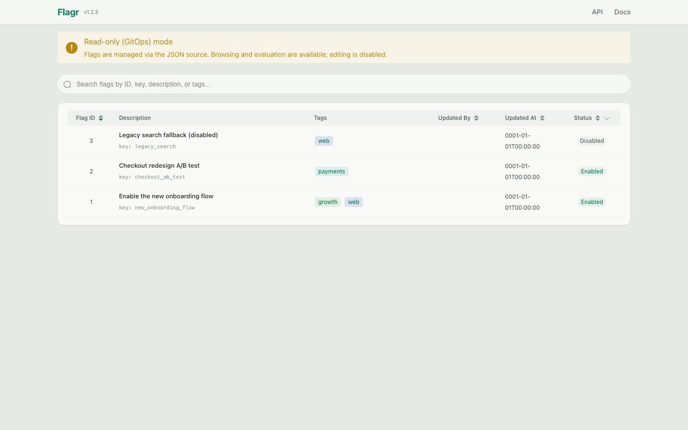
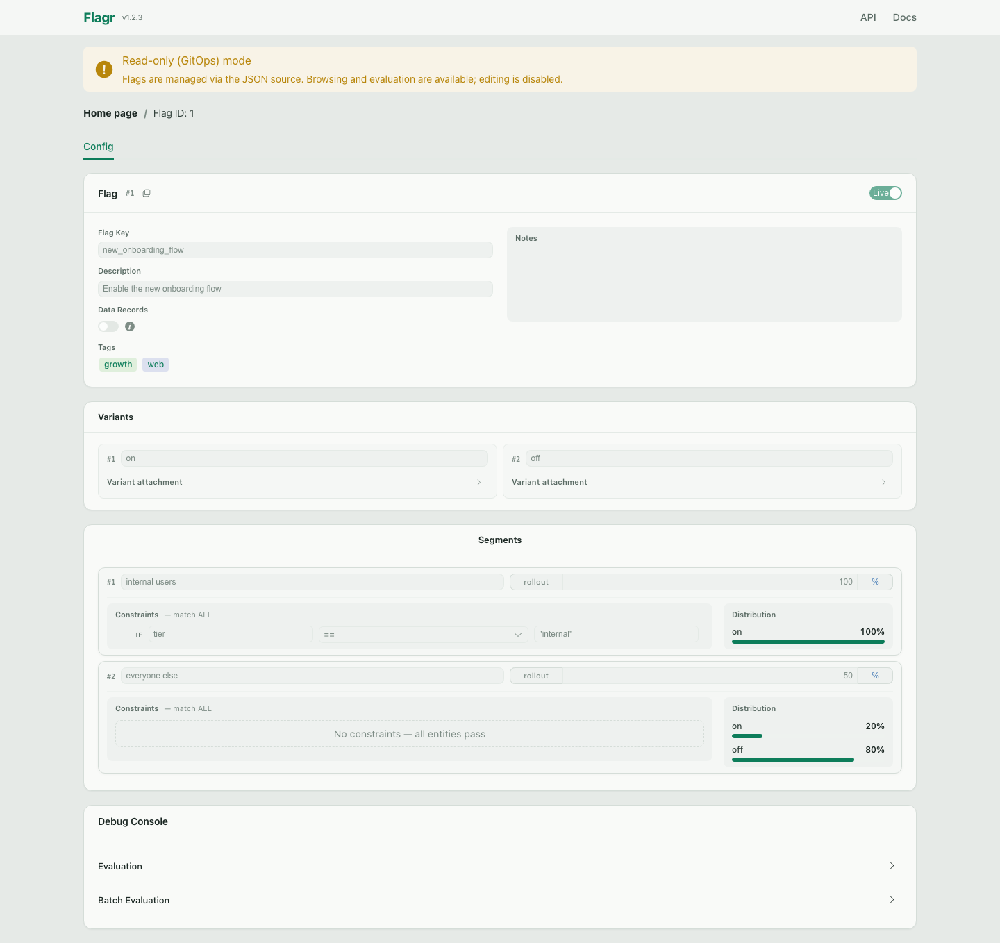
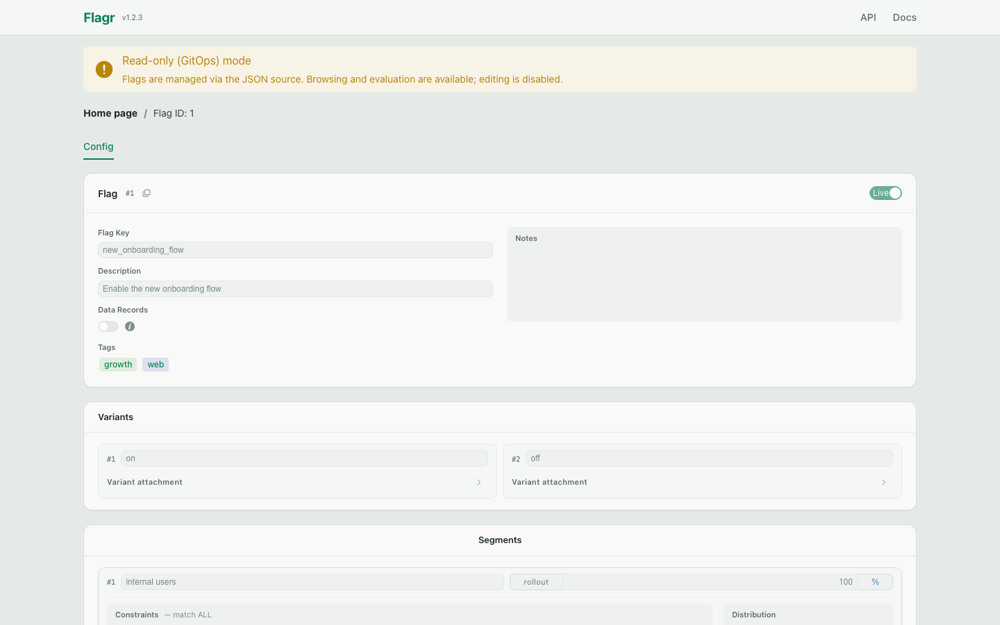

# feat: Read-only UI for eval-only mode (`json_file` / `json_http`)

**Date:** 2026-07-30
**Status:** implemented

## Summary

Eval-only mode (`json_file` / `json_http` drivers, or `FLAGR_EVAL_ONLY_MODE=true`)
currently registers only health, evaluation, and eval-cache export handlers. The
UI static assets are still served (`FLAGR_UI_ENABLED` defaults to true), but every
CRUD call the UI makes returns 501, so the UI is effectively broken on eval-only
deployments.

The flag data is already in memory (EvalCache) and already exposed via
`GET /api/v1/export/eval_cache/json`. This plan serves the UI's read path from
the EvalCache so operators can browse flags, inspect segments/variants, and use
the Debug Console on eval-only (GitOps) nodes — while all writes stay rejected.

## Design

### Backend

1. **Read-only CRUD handlers from EvalCache** (`pkg/handler/crud_readonly.go`)

   Registered by `handler.Setup` when `config.Config.EvalOnlyMode` is true.
   Data source is `GetEvalCache()` (never the DB); responses reuse the existing
   `e2r` mappers so payload shapes are identical to DB-backed CRUD.

   | Endpoint | Behavior |
   |----------|----------|
   | `GET /flags` | List from cache; supports `enabled`, `key`, `description`, `description_like`, `tags` (ANY), `limit`, `offset`; `deleted=true` returns `[]` (JSON source has no soft-deletes); sorted by ID |
   | `GET /flags/{flagID}` | From cache; 404 when missing |
   | `GET /flags/entity_types` | `[]` (entity types are DB-only) |
   | `GET /flags/snapshots/max_id` | EvalCache content fingerprint (see below) |
   | `GET /flags/{flagID}/snapshots` | `[]` (history lives in Git, not in the JSON source) |
   | `GET /tags`, `GET /flags/{flagID}/tags` | From cache |
   | `GET /flags/{flagID}/segments` / `variants` / `.../constraints` / `.../distributions` | From cached flag; 404 when flag missing |
   | All write operations (POST/PUT/DELETE on CRUD resources) | **403** with message `read-only (eval-only) mode: flags are managed via the JSON source (FLAGR_DB_DBDRIVER=json_file/json_http)` |

   Writes were previously unregistered (501 "not implemented"); an explicit 403
   with a pointer to the JSON source is the real contract.

2. **EvalCache content fingerprint** (`pkg/handler/eval_cache.go`)

   The UI's list-page cache asks `GET /flags/snapshots/max_id` for a cheap
   change token (`listFlagsIfStale`). Eval-only mode has no snapshots, so the
   read-only handler returns a **fingerprint of the cache content**: FNV-1a 64
   of the marshaled flags, masked to a non-negative int64, recomputed on each
   successful reload (eval-only mode only). Equality is the only contract the
   UI relies on, so a hash is a drop-in change token — the JSON source changes,
   the fingerprint changes, the UI refetches.

   Also adds `EvalCache.GetAllFlags()` — RLock + copy, ID-sorted — as the data
   source for the read-only handlers.

3. **Mode discovery: `evalOnlyMode` on `GET /health`**

   The UI needs to know it should render read-only. `health` is the one
   endpoint every mode serves, so the response gains an `evalOnlyMode` boolean
   (`swagger/index.yaml` → `make gen`). Response stays backward-compatible.

### Frontend (`browser/flagr-ui/`)

1. **Server mode state** — `src/api/health.ts` (`getHealth`) +
   `src/helpers/serverMode.ts`: module-level reactive `evalOnlyMode` ref,
   fetched once at app start. Fail-open: if health can't be read, assume
   writable (a broken health check shouldn't lock the UI).
2. **Read-only rendering** — components import the ref directly (no prop
   drilling):
   - Global banner: "Read-only (GitOps) mode — flags are managed via the JSON source".
   - Flags list: hide New Flag form and deleted-flags view.
   - Flag page: hide save/delete buttons, enabled toggle, tag add/remove,
     variant/segment/constraint/distribution editors and reorder; hide the
     History tab (no snapshots).
   - **Debug Console stays** — evaluation works in eval-only mode and is the
     main reason to open the UI on an eval edge node.
3. UI hiding is UX, not enforcement — the backend 403 is the gate.

### Docs

- `docs/flagr_behavioral_contracts.md` — eval-only surface changes from
  "evaluation + health + export only" to "… + read-only CRUD GETs, writes 403".
- `docs/flagr_env.md`, `docs/flagr_json_flag_spec.md`, `docs/integration.md` —
  mention the read-only UI on eval-only deployments.

## Decisions

- **No new env var.** Read-only GETs expose the same data as the existing
  eval-cache export endpoint, so there is no new exposure surface; auth
  middlewares (JWT/Basic) apply unchanged. An opt-out flag can be added later
  if a use case appears.
- **Standard CRUD GET routes, not the export endpoint, feed the UI.** The
  export payload is `entity.Flag` JSON; the UI's types are the swagger models.
  Reusing the CRUD routes + `e2r` mappers keeps one data model on both ends.
- **`GET /flags` ignores `preload`** and always returns fully-populated flags
  (the cache holds complete flags; trimming them would be extra code for no
  caller benefit).
- **Snapshots return `[]`, not 404** — the UI treats it as "no history" without
  special-casing; change history for JSON-sourced flags lives in Git.

## Files changed (as-built)

| File | Change |
|------|--------|
| `swagger/index.yaml` | `health` definition gains `evalOnlyMode` boolean |
| `docs/api_docs/bundle.yaml`, `swagger_gen/` | regenerated (`make gen`) |
| `pkg/handler/handler.go` | `setupCRUD` takes a `CRUD` impl; eval-only Setup registers `NewReadOnlyCRUD()`; health returns `evalOnlyMode` |
| `pkg/handler/eval_cache.go` | `GetAllFlags()`, `GetByFlagID()`, `ContentFingerprint()`; fingerprint stored on reload |
| `pkg/handler/eval_cache_fetcher.go` | `loadAndBuildCaches` returns `(*cacheContainer, fingerprint, error)`; `flagsFingerprint` (FNV-1a 64, int63-masked) |
| `pkg/handler/crud_readonly.go` | read-only CRUD implementation (reads from EvalCache, writes 403) |
| `pkg/handler/crud_readonly_test.go` | tests: filters, 404s, 403s, tags dedupe, fingerprint, health field, Setup wiring |
| `browser/flagr-ui/src/api/health.ts`, `api/types.ts` | `getHealth` + `Health` DTO |
| `browser/flagr-ui/src/helpers/serverMode.ts` (+ test) | reactive `evalOnlyMode` ref, `initServerMode()` (fail-open) |
| `browser/flagr-ui/src/App.vue` | read-only banner; mode fetch on created |
| `browser/flagr-ui/src/components/Flags.vue` | hide Create Flag + Deleted Flags in read-only |
| `browser/flagr-ui/src/components/Flag.vue` | hide Flag Management + History tab; pass `readonly` to sections; snap to Config if mode turns read-only |
| `browser/flagr-ui/src/pages/flagPage.ts` (+ test) | `applyDeepLink` routes history deep links to Config in read-only mode |
| `browser/flagr-ui/src/components/FlagConfigCard.vue` | `readonly` prop: disable inputs/switches, hide save/tag/notes-edit controls |
| `browser/flagr-ui/src/components/VariantsSection.vue` | `readonly` prop: disable key input, read-only attachment editor, hide actions/add row |
| `browser/flagr-ui/src/components/SegmentsSection.vue` | `readonly` prop: disable inputs, hide reorder/new/save/delete/edit-distribution |
| `browser/flagr-ui/src/components/ConstraintExistingRow.vue`, `ConstraintValueCell.vue` | `readonly`/`disabled` props threaded to constraint cells |
| `docs/flagr_behavioral_contracts.md`, `flagr_env.md`, `flagr_json_flag_spec.md`, `integration.md`, `flagr_overview.md` | eval-only contract update |

## Screenshots (json_file source, 3 sample flags)

Flags list — banner, no Create Flag, no Deleted Flags:

Flag page — inputs disabled, no save/delete/reorder/add controls, no History
tab, Debug Console available:

`?tab=history` deep link lands on Config:

## As-built notes

- Deep-linking `?tab=history` on a read-only instance routes to the Config tab
  (`applyDeepLink` guards on `evalOnlyMode`; a `Flag.vue` watcher covers the
  race where `/health` resolves after the deep link already opened History).
  Change history for JSON-sourced flags lives in Git.
- The app resolves the server mode **before first paint**: `main.ts` awaits
  `initServerMode()` (bounded by a 1.5s timeout) before `app.mount`, so a
  read-only deployment never flashes editable controls. If `/health` exceeds
  the timeout, the app mounts fail-open (editable UI, backend 403 backstop);
  the `Flag.vue` watcher and reactive refs correct the UI when the late
  response arrives.
- `GET /flags` in read-only mode returns fully-populated flags regardless of
  `preload` (cache holds complete flags); DB mode without `preload` returns
  tags only. No UI-visible difference.
