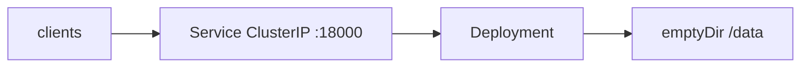

# Official Helm chart for Flagr

**Date:** 2026-09-16
**Status:** Draft
**Author:** TBD
**Issue:** [#781](https://github.com/openflagr/flagr/issues/781)
**Contributor prototype:** [ericbsantana/flagr-helm-chart](https://github.com/ericbsantana/flagr-helm-chart) (file-layout donor only)

---

## Overview

Flagr already publishes `ghcr.io/openflagr/flagr` and documents Kubernetes as: bind `0.0.0.0:18000`, probe `GET /api/v1/health`, env-only config (`pkg/config/env.go`, [`docs/flagr_env.md`](../flagr_env.md)). Self-host currently says **"No in-repo Helm chart."**

Add a **small application chart at repo-root `helm/`**. `helm install flagr ./helm` yields a working single-replica SQLite demo. Operators configure Flagr themselves with Kubernetes `env` / `envFrom` and the env doc — the chart does not grow a values schema for databases, Ingress, or every `FLAGR_*` key.

PR 1: source + CI + self-host docs (install from git path). PR 2: OCI `oci://ghcr.io/openflagr/charts/flagr`.

---

## Background & Motivation

The image, port, health endpoint, and env-only config are already the documented self-host path. What is missing is a repeatable, versioned Kubernetes install next to the app. Issue #781 offers a prototype under `charts/flagr`; we take the idea and **not** the kitchen-sink surface. Audience: people who already know Helm and Kubernetes. The env doc is the config surface.

---

## Goals & Non-Goals

### Goals

- `helm install flagr ./helm` is a healthy ClusterIP `:18000` demo (SQLite, probes, non-root).
- Every `FLAGR_*` knob is reachable via `env` / `envFrom` without a chart release.
- Helm CI is path-filtered on `helm/**` so Go/UI PRs do not start Kind.
- Self-host docs: install, port-forward, curl health, “configure via env.”

### Non-Goals (v1)

- Ingress, HPA, PDB, NetworkPolicy, ServiceMonitor, Gateway, extraObjects, chart-created ServiceAccount or PVC.
- First-class `database.*`, `webPrefix`, `metrics.*` values.
- Bundled MySQL/Postgres (especially Bitnami). Mapping `env.go` 1:1. Operator/CRDs. Recorder subcharts.
- helm-docs, kubeconform matrix, `examples/`, `charts/` nesting. helm-unittest (`helm/tests/`) **is** in v1 — CI `lint` job runs `make helm-unittest`.
- Artifact Hub listing. Required GitHub check on `helm.yml` while `on.paths` skips it.

---

## Key Decisions

| # | Decision | Rationale |
|---|---|---|
| D1 | **Source at `helm/`**, not `charts/flagr/` | This already *is* the Flagr repo. `helm install flagr ./helm`. OCI remains `oci://ghcr.io/openflagr/charts/flagr` (`Chart.yaml` `name: flagr`) so GHCR packages stay grouped. |
| D2 | **No database subchart.** Default SQLite; SQL/JSON via `env` | Bitnami 2025–2026 catalog change burned Unleash/Flagsmith/Gitea. n8n-io: “this chart does not bundle them.” |
| D3 | **`env` + `envFrom` + flagr_env.md, not a values schema** | ~80 keys. Operators already read the env doc. Traefik/ingress-nginx/Unleash extraEnv lists, not Authelia’s 1:1 map. |
| D4 | **No Ingress (or HPA/PDB/NP/SM) in the chart** | Audience writes those manifests. NOTES: port-forward; “add your own Ingress.” |
| D5 | **Document SQLite HA; do not `fail` in templates** | SQLite is not a shared store. A values comment + self-host line is enough. |
| D6 | **PR 1 = source + CI + docs. PR 2 = OCI.** | Answers #781 Q3. Do not block on GHCR. |
| D7 | **Chart `version` ≠ `appVersion` ≠ git tag** | Image tag defaults to `appVersion` (today **1.2.4**). Unleash/Traefik do this; do not lockstep like GrowthBook. |
| D8 | **No Bitnami `common` library. Vanilla templates.** | One binary, six template files. |
| D9 | **Chart injects a few safer K8s env defaults** | `FLAGR_PPROF_ENABLED=false`, `FLAGR_DB_DBCONNECTION_DEBUG=false`, `FLAGR_LOGRUS_FORMAT=json`. Process/docker-run differ; self-host says so. Re-enable pprof via `env`. |
| D10 | **Prototype is a layout donor only** | Drop bitnami/jwt-cli tests, Ingress, HPA, helm-docs auto-commit. Credit @ericbsantana in the PR, not `Chart.yaml` maintainers (`openflagr` org). |

---

## Proposed Design

### Layout (this is the whole chart)

```
helm/
  Chart.yaml
  values.yaml
  .helmignore
  templates/
    _helpers.tpl
    deployment.yaml
    service.yaml
    NOTES.txt
    tests/test-health.yaml
  tests/                      # helm-unittest (no cluster)
    deployment_test.yaml
    service_test.yaml
```

Install: `helm install flagr ./helm --namespace flagr --create-namespace`.



### Chart.yaml

```yaml
apiVersion: v2
name: flagr
description: Flagr — feature flags, A/B tests, and dynamic configuration
type: application
version: 0.1.0          # 1.0.0 at first OCI publish
appVersion: "1.2.4"
kubeVersion: ">=1.25.0-0"
home: https://openflagr.github.io/flagr
sources:
  - https://github.com/openflagr/flagr
maintainers:
  - name: openflagr
    url: https://github.com/openflagr
```

Bump `appVersion` + chart **patch** on every Flagr release (even if templates are unchanged). OCI tag is chart `version`, not the git tag.

### Default install

| Piece | Default |
|---|---|
| Replicas | 1 |
| Image | `ghcr.io/openflagr/flagr:{{ .Chart.AppVersion }}` |
| Service | ClusterIP `:18000` |
| Probes | `GET /api/v1/health` on named port `http` |
| `/data` | emptyDir (not a PVC) |
| SQLite | `/data/flagr.sqlite` (Helm-owned; GORM auto-migrates; **not** image seed `demo_sqlite3.db`) |
| SA | default namespace SA; pod `automountServiceAccountToken: false` |
| Security | drop ALL, `runAsNonRoot: true`; UID/`fsGroup` verified at impl with `docker run --rm --entrypoint id ghcr.io/openflagr/flagr` |

Persistence: operators create a PVC and attach it with `extraVolumes` / `extraVolumeMounts`. No `pvc.yaml`.

### Env assembly

Kubernetes applies `envFrom` **first**, then the container `env` list (last duplicate key in `env` wins). `envFrom` cannot override chart keys.

Chart invariants (always), then operator `env`:

1. `HOST=0.0.0.0`
2. `PORT=18000`
3. `FLAGR_LOGRUS_FORMAT=json`
4. `FLAGR_DB_DBCONNECTION_DEBUG=false` — process default `true` may log credentials (`env.go`)
5. `FLAGR_PPROF_ENABLED=false` — process/docker-run default `true` (D9)
6. `FLAGR_DB_DBDRIVER=sqlite3`
7. `FLAGR_DB_DBCONNECTIONSTR=/data/flagr.sqlite`
8. **`env`** (list of EnvVar) — override driver, DSN, JWT, retries, `FLAGR_WEB_PREFIX`, pprof, everything
9. **`envFrom`** — whole Secret/ConfigMap bags for keys the chart did not set

Postgres (self-host / NOTES snippet, **not** a chart `examples/` file):

```yaml
env:
  - name: FLAGR_DB_DBDRIVER
    value: postgres
  - name: FLAGR_DB_DBCONNECTIONSTR
    valueFrom:
      secretKeyRef:
        name: flagr-db
        key: FLAGR_DB_DBCONNECTIONSTR
  - name: FLAGR_DB_DBCONNECTION_RETRY_ATTEMPTS
    value: "30"
  - name: FLAGR_DB_DBCONNECTION_RETRY_DELAY
    value: "2s"
```

`pkg/entity/db.go` retries then `logrus.Fatal` (~9 × 100ms by default). Raise retries yourself; a startupProbe cannot help a process that exits. JSON eval-only is the same pattern (`json_http` / `json_file` + a volume for the file). Full list: [`docs/flagr_env.md`](../flagr_env.md).

**`FLAGR_WEB_PREFIX`:** not a Helm value. If set via `env`, also override `livenessProbe.httpGet.path` and `readinessProbe.httpGet.path` (and the helm-test curl path). JWT/basic middleware matches the **original** path before `StripPrefix` — prefixed whitelist paths belong in `env` too. No `flagr.webPath` helper.

SQLite + `replicaCount > 1`: do **not** `fail`. One-line comment in `values.yaml` and self-host: SQLite is not a shared store; use postgres/mysql/json_http.

### values.yaml (short)

Image (`repository`, `tag` empty → appVersion, `pullPolicy`, `imagePullSecrets`), `replicaCount`, `nameOverride` / `fullnameOverride`, `service` (type ClusterIP, port 18000), `resources`, `nodeSelector` / `affinity` / `tolerations`, `podAnnotations` / `podLabels`, `podSecurityContext` / `securityContext`, `env`, `envFrom`, `extraVolumes` / `extraVolumeMounts`, overridable `livenessProbe` / `readinessProbe`. Optional `test.image` (`curlimages/curl:8.1.2`, never `:latest`).

No ingress, database, webPrefix, autoscaling, networkPolicy, extraObjects.

### NOTES.txt

1. `kubectl -n … port-forward svc/… 18000:18000`
2. `curl -sS http://127.0.0.1:18000/api/v1/health`
3. Configure via `env` / `envFrom` — [`flagr_env.md`](https://openflagr.github.io/flagr/flagr_env). Add your own Ingress. PVC: create it, mount `/data` with `extraVolumes`. SQLite is not HA.

### CI

`.github/workflows/helm.yml`:

```yaml
on:
  pull_request:
    paths: [helm/**, .github/workflows/helm.yml]
  push:
    branches: [main]
    paths: [helm/**, .github/workflows/helm.yml]
```

Not a job on `ci.yml`. **Do not** list `Makefile`. **Do not** make this workflow a required check while `on.paths` skips Go PRs.

Jobs: `make helm-lint` (`helm lint --strict` + `helm template`), `make helm-unittest` (plugin v1.1.2, `helm/tests/`), Kind + `helm install` + `helm test` (health curl). No `ct.yaml`, helm-docs, or kubeconform matrix.

Makefile: `make helm-lint` and `make helm-unittest`. Kind stays GHA-only.

PR 2: `.github/workflows/cd_helm.yml` on `release: published` + `workflow_dispatch`. Package `helm/`, fail if that chart version already exists on GHCR, `helm push` to `oci://ghcr.io/openflagr/charts/flagr`.

---

## API / Interface Changes

None to Flagr HTTP or `env.go`. Operator interface is Helm values above plus `env` / `envFrom`.

---

## Data Model Changes

None in Flagr’s schema. Chart objects by default: Deployment, ClusterIP Service, emptyDir `/data`. No generated Secrets or passwords.

---

## Alternatives Considered

1. **Dedicated `openflagr/helm-charts` repo** — Unleash/Flagsmith/Grafana size. Rejected: one chart, one process; issue and maintainer want one place.
2. **`charts/flagr/` in this repo** — GrowthBook/ingress-nginx convention. Rejected: redundant nesting when the repo *is* Flagr. Source is `helm/`; OCI name can still be `charts/flagr`.
3. **Bundled Postgres (Bitnami or alpine image)** — Unleash/Flagsmith still carry the scar. Rejected; SQLite is the demo.
4. **1:1 Helm values for every `FLAGR_*`** — Authelia. Rejected; env doc is the source of truth.
5. **helm create kitchen-sink (Ingress, HPA, PDB, NP, SA, PVC)** — prototype and #781’s wishlist. Rejected: this audience already writes those objects; the chart’s job is Deployment + Service + probes + env.
6. **OCI in PR 1** — GrowthBook pushes on tag. Rejected: source+CI must merge without registry wiring (#781 Q3).
7. **Gateway API** — Unleash/Flagsmith invested; Grafana still marks it BETA. Out of v1; operators apply HTTPRoute themselves.

---

## Security & Privacy

No chart-generated Secrets. DSN/JWT/basic/recorders go in `env` `valueFrom` / `envFrom`. Chart forces `FLAGR_DB_DBCONNECTION_DEBUG=false` and `FLAGR_PPROF_ENABLED=false` (pprof is not auth-gated). `automountServiceAccountToken: false`. drop ALL + `runAsNonRoot`. `readOnlyRootFilesystem` is not default (`/data` must be writable). Pin image to `appVersion`, not `latest`.

---

## Observability

JSON logs. Probes and `helm test` on `/api/v1/health`. Prometheus/`/metrics` and pprof are **off** until the operator sets env (and, for scrape, their own ServiceMonitor).

---

## Rollout Plan

**PR 1:** `helm/` + path-filtered `helm.yml` + `make helm-lint` + self-host/CONTRIBUTING/AGENTS. Install from checkout. Chart `0.1.0`.

**PR 2:** `cd_helm.yml`, chart `1.0.0`, self-host primary install becomes `helm install flagr oci://ghcr.io/openflagr/charts/flagr`. Seed GHCR with `workflow_dispatch` if needed.

Rollback: `helm rollback flagr`. Bad image: `--set image.tag=…`.

---

## Resolved questions

| Topic | Decision |
|---|---|
| Chart path | **`helm/`** (not `charts/flagr/`). OCI `oci://ghcr.io/openflagr/charts/flagr`. |
| Values surface | No Ingress/HPA/PDB/NP/SM/extraObjects; no `database.*` / `webPrefix` / `metrics.*`; no `examples/`. |
| Config | `env` / `envFrom` + [`flagr_env.md`](../flagr_env.md). |
| SQLite file | `/data/flagr.sqlite`. GORM auto-migrates. Not `demo_sqlite3.db`. |
| pprof | Chart `FLAGR_PPROF_ENABLED=false`. Re-enable via `env`. |
| Artifact Hub | Later manual listing after OCI. Not PR 1 or PR 2. |
| Chart.yaml maintainers | `openflagr` org. Credit @ericbsantana in the PR/README only. |
| SQLite + replicas | Document, don’t `fail`. |
| Persistence / Ingress | Operator PVC + `extraVolumes`; operator Ingress. |

**Implementation check:** `docker run --rm --entrypoint id ghcr.io/openflagr/flagr` at PR 1 start; `runAsUser` / `fsGroup` follow the image.

---

## References

- [#781](https://github.com/openflagr/flagr/issues/781); prototype https://github.com/ericbsantana/flagr-helm-chart
- This tree: [`docs/flagr_self_host.md`](../flagr_self_host.md), [`docs/flagr_env.md`](../flagr_env.md), [`pkg/config/env.go`](../../pkg/config/env.go), [`pkg/entity/db.go`](../../pkg/entity/db.go) (retries then Fatal), [`Dockerfile`](../../Dockerfile), [`cd_docker.yml`](../../.github/workflows/cd_docker.yml)
- Learned from (not copied): Unleash/Flagsmith (Bitnami scar, extraEnv); GrowthBook (in-app chart + OCI); n8n-io / Woodpecker (SQLite default, no bundled prod DB); Grafana / Traefik (`env`/`envFrom`, extraObjects we are **not** taking); ingress-nginx (`extraEnvs` list); CNCF 2025-09-24 Bitnami ≠ Helm-the-project

---

## PR Plan

### PR 1 — `feat: official Helm chart (helm/)`

**Depends on:** nothing. Answers #781 Q1 (yes, in this repo) and Q2 (path is `helm/`, not `charts/flagr`). Q3 = not this PR.

**Files:** `helm/**`, `.github/workflows/helm.yml`, `Makefile` (`helm-lint` + help), `docs/flagr_self_host.md`, `docs/flagr_env.md` (one-line pointer), `docs/CONTRIBUTING.md` (release bump of `helm/Chart.yaml`), `AGENTS.md`, root `README.md`.

**What:** The six-file chart above. `helm test` health pod (`curlimages/curl:8.1.2`). Kind only on `helm/**`. Self-host: install from `./helm`, port-forward, curl, Postgres `env` snippet, chart-vs-process defaults (pprof/debug/json logs), SQLite is not HA.

**Reply on #781:** Deployment + ClusterIP + probes + env/Secrets + sqlite default + SQL/JSON via env + helm test + lint/template/Kind + docs. Ingress/SA/HPA/persistence are **out of the chart**; K8s-fluent operators attach them.

### PR 2 — `ci: publish Helm chart to oci://ghcr.io/openflagr/charts/flagr`

**Depends on:** PR 1; `packages: write` (same as `cd_docker.yml`).

**Files:** `.github/workflows/cd_helm.yml`; `helm/Chart.yaml` → `1.0.0`; self-host + NOTES primary install → OCI.

**Not in these PRs:** Ingress/HPA/PDB, bundled DB, Artifact Hub listing, env.go 1:1 values.
